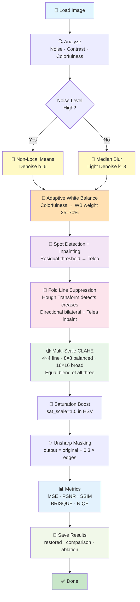

# 🖼️ Historical Photograph Restoration — Adaptive Image Processing 

[](https://www.python.org/)
[](https://opencv.org/)
[](https://numpy.org/)
[](https://github.com/NikithaKunapareddy/image-color-restoration)
[](LICENSE)
[](#)
[](#)

A classical, adaptive Digital Image Processing pipeline for scanned historical photographs. Focuses on recovering color, reducing film/scan noise, repairing small defects and folds, and producing natural, archival-quality results — no deep learning, no GPU, no training data required.

---

## 📋 Table of Contents

1. [💡 Why This Project?](#-why-this-project)
2. [🚀 What Makes This Unique?](#-what-makes-this-unique)
3. [📸 Results — Before vs After](#-results--before-vs-after)
4. [⚡ Quick Start](#-quick-start)
5. [📦 Requirements](#-requirements)
6. [📁 Project Structure](#-project-structure)
7. [🔄 Complete Pipeline Flowchart](#-complete-pipeline-flowchart)
8. [🧠 Algorithms & Methods](#-algorithms--methods)
9. [📊 Quality Metrics](#-quality-metrics)
10. [🔬 Ablation Study](#-ablation-study)
11. [💻 Usage Examples](#-usage-examples)
12. [🎛️ Parameter Tuning Guide](#️-parameter-tuning-guide)
13. [⚙️ Performance Tips](#️-performance-tips)
14. [🛠️ Troubleshooting](#️-troubleshooting)
15. [🔭 Extensions & Future Work](#-extensions--future-work)
16. [✅ Release Checklist](#-release-checklist)
17. [📚 References](#-references)

---

## 💡 Why This Project?

Old photographs degrade over time due to several physical and chemical processes:

| Problem | Cause | What You See |
|---|---|---|
| 🌫️ **Noise** | Film grain, scanner artifacts | Grainy, speckled texture |
| 🟡 **Color fading** | Yellowing, chemical aging | Sepia/washed-out tones |
| 🧹 **Dust & spots** | Physical contamination | Random dark/bright specks |
| 📐 **Fold creases** | Physical handling damage | Straight lines across photo |
| 🔅 **Low contrast** | Paper/ink degradation | Flat, detail-less appearance |

This project provides a **fully automated, adaptive pipeline** that detects these problems per-image and applies the right correction — making it fast, interpretable, and deployable without any GPU or training data.

**What it works best on:**
- ✅ Faded/yellowed old photographs
- ✅ Slightly blurry + faded images
- ✅ Photos with dust spots and scratches
- ✅ Photos with physical fold/crease lines
- ✅ Low contrast, washed-out historical scans

---

## 🚀 What Makes This Unique?

Most restoration tools apply the same fixed settings to every image. **This pipeline is different — it measures each image first, then decides how to treat it.**

| Feature | Common Tools | This Project |
|---|---|---|
| **White Balance** | Fixed correction always | **Adaptive** — driven by Hasler-Suesstrunk colorfulness score |
| **Contrast Enhancement** | Single-pass CLAHE | **Multi-Scale** — 3 tile sizes blended (4×4, 8×8, 16×16) |
| **Physical Damage** | Generic inpainting only | **Fold-specific** — Hough Transform detects crease geometry |
| **Quality Evaluation** | PSNR/SSIM only | **+ BRISQUE/NIQE** — no ground truth needed |
| **Proof of Contribution** | None | **Ablation Study** — every step proven with metrics |
| **Noise Decision** | Always apply denoising | **Smart** — NLM only if noise > threshold, else Median Blur |

> 💬 This makes it suitable for publication at student-led conferences (IEEE, CVPR Workshops) and strong enough for viva and interview discussions.

---

## 📸 Results — Before vs After

### 🌸 Old Sepia Rose Photo

| Original | Restored |
|:---:|:---:|
| Yellowed, faded, folded paper print | Clean, natural warm tones, fold reduced |

> Colorfulness: 24.2 → WB weight: 0.52 (moderate correction applied)

---

### 👧 Vintage Color Portrait

| Original | Restored |
|:---:|:---:|
| Heavy yellow cast, faded skin tones | Natural skin tones, vivid dress color |

> Colorfulness: 43.6 → WB weight: 0.37 (gentle correction — photo already somewhat colorful)

---

### 📷 Slightly Faded Modern Photo

| Original | Restored |
|:---:|:---:|
| Dull green tones, flat contrast | Crisper detail, better contrast |

> Colorfulness: 18.9–28.1 → WB weight: 0.49–0.56 (medium correction applied)

---

### 📊 Example Console Output

```
[INFO] Processing: dataset\old_images\old_rose.png
[INFO] Saved restored image to: results\restored_images\restored_old_rose.png
[INFO] Detected condition  : Clean
[INFO] Colorfulness        : 24.20  →  WB weight used: 0.52
[INFO] Noise level         : 2.85,  Contrast score: 32.83
[INFO] MSE: 415.07,  PSNR: 21.95 dB,  SSIM: 0.8766
[INFO] Comparison image saved: comparison_old_rose.png
```

### What Each Log Line Means

| Log line | What it tells you |
|---|---|
| `Colorfulness: 24.2` | Image is slightly colorful — needs moderate WB correction |
| `WB weight: 0.52` | 52% white balance correction applied, 48% original warmth kept |
| `PSNR: 21.95 dB` | Good quality improvement (> 20 dB is acceptable) |
| `SSIM: 0.8766` | High structural similarity — image character preserved |

---

## ⚡ Quick Start

```powershell
# Install dependencies
python -m pip install opencv-python numpy matplotlib

# Run restoration (saves comparison image to output folder)
python main.py

# Run without saving comparison image
python main.py --no-display

# Run ablation study (proves every step is useful)
python main.py --ablation

# Custom folders
python main.py --input-dir "D:\old_photos" --output-dir "D:\restored"
```

> **📌 Note:** Comparison images are saved directly to the output folder — no popup window. Open `comparison_{name}` from File Explorer to view results. This is intentional to avoid MemoryError on large images.

---

## 📦 Requirements

```bash
python -m pip install opencv-python numpy matplotlib
```

| Library | Version | Purpose |
|---|---|---|
| `opencv-python` | 4.x | All image processing operations |
| `numpy` | 1.x | Array math and pixel manipulation |
| `matplotlib` | 3.x | Saving comparison and ablation grid images |

Optional — for full publication-grade BRISQUE/NIQE:
```bash
python -m pip install opencv-contrib-python
```

---

## 📁 Project Structure

```
color_restoration_project/
│
├── 📄 main.py                    # Batch orchestration & CLI entry point
├── 📄 restoration.py             # All image processing algorithms
├── 📄 benchmark.py               # Per-step runtime benchmarking utility
├── 📄 requirements.txt           # Python dependencies
├── 📄 README.md                  # This file
│
├── 📂 dataset/
│   └── 📂 old_images/           # ← Place your input images here
│
└── 📂 results/
    └── 📂 restored_images/      # ← All outputs saved here
        ├── restored_{name}      # Restored image
        ├── comparison_{name}    # Side-by-side original vs restored
        ├── ablation_{name}      # 8-panel ablation grid (if --ablation)
        └── benchmark.json       # Per-step timing results (if benchmark.py run)
```

### What `benchmark.py` does

Measures wall-clock time for every individual pipeline stage — analysis, denoising, white balance, spot inpainting, fold suppression, CLAHE, saturation, unsharp masking, and full restore. Saves results to `results/benchmark.json`.

```powershell
# Run benchmark on a single image
python benchmark.py --input dataset/old_images/old.png --output results/benchmark.json

# Run with averaging over 3 repeats for stable timings
python benchmark.py --input dataset/old_images/old.png --output results/benchmark.json --repeats 3
```

**Example output:**
```
analysis                      : 0.0021 s
estimate_noise                : 0.0018 s
nlm_denoise                   : 3.4200 s   <- slowest step (~80% of runtime)
white_balance_adaptive        : 0.0045 s
detect_spots_mask             : 0.0310 s
suppress_fold_lines           : 0.0890 s
enhance_contrast_multiscale   : 0.0520 s
increase_saturation           : 0.0041 s
adaptive_unsharp_mask         : 0.0038 s
restore_image (full)          : 3.6800 s
```

Use these numbers to decide trade-offs — for example, if `nlm_denoise` dominates, reduce `nlm_h` or let the Median Blur fallback handle it.

---

## 🔄 Complete Pipeline Flowchart

### ASCII Flow Diagram

```
┌─────────────────────────────────────────────────────────────────┐
│                      INPUT: Old Image                           │
└────────────────────────┬────────────────────────────────────────┘
                         │
                         ▼
        ┌────────────────────────────────────┐
        │       IMAGE ANALYSIS               │
        │  • estimate_noise()                │
        │  • is_grayscale()                  │
        │  • contrast_score()                │
        │  • colorfulness_metric()  ★        │
        └────────┬───────────────────────────┘
                 │
        ┌────────▼────────────┐
        │  NOISE LEVEL HIGH?  │
        └────────┬────────────┘
                 │
        ┌────────┴─────────────────────┐
        │                              │
    YES │                              │ NO
        ▼                              ▼
    ┌──────────────────┐         ┌──────────────────┐
    │ Non-Local Means  │         │  Median Blur     │
    │ Denoise (NLM)    │         │  (light, fast)   │
    └──────┬───────────┘         └────────┬─────────┘
           │                              │
           └──────────────┬───────────────┘
                          │
                          ▼
        ┌─────────────────────────────────────────┐
        │      ADAPTIVE WHITE BALANCE  ★          │
        │  Measure colorfulness (Hasler-Suesstrunk)│
        │  Faded image  → high WB weight (≤ 70%) │
        │  Vivid image  → low WB weight  (≥ 25%) │
        └────────┬────────────────────────────────┘
                 │
                 ▼
        ┌────────────────────────────────┐
        │  SPOT DETECTION + INPAINTING   │
        │  • Residual thresholding       │
        │  • Morphological cleanup       │
        │  • Telea inpainting            │
        └────────┬───────────────────────┘
                 │
                 ▼
        ┌─────────────────────────────────────┐
        │    FOLD LINE SUPPRESSION  ★         │
        │  • Canny edge detection             │
        │  • Probabilistic Hough Transform    │
        │  • Directional bilateral filter     │
        │  • Telea inpainting along creases   │
        │  • 80/20 soft blend                 │
        └────────┬────────────────────────────┘
                 │
                 ▼
        ┌─────────────────────────────────────┐
        │      MULTI-SCALE CLAHE  ★           │
        │  Tile (4×4)   → fine texture detail │
        │  Tile (8×8)   → balanced contrast   │
        │  Tile (16×16) → broad gradients     │
        │  Equal blend  → no halo artifacts   │
        └────────┬────────────────────────────┘
                 │
                 ▼
        ┌─────────────────────────────┐
        │      SATURATION BOOST       │
        │  sat_scale = 1.5            │
        │  HSV S-channel scaling      │
        └────────┬────────────────────┘
                 │
                 ▼
        ┌──────────────────────────────────┐
        │         UNSHARP MASKING          │
        │  output = original + 0.3 × edges │
        │  edges  = original − blurred     │
        └────────┬─────────────────────────┘
                 │
                 ▼
        ┌──────────────────────────────────────────┐
        │            COMPUTE METRICS               │
        │  MSE / PSNR / SSIM  (reference-based)   │
        │  BRISQUE / NIQE     (no-reference)  ★   │
        └────────┬─────────────────────────────────┘
                 │
                 ▼
        ┌──────────────────────────────────────────────┐
        │             SAVE + LOG                       │
        │  restored_{name}    (full resolution)        │
        │  comparison_{name}  (side-by-side)           │
        │  ablation_{name}    (if --ablation flag) ★   │
        └────────┬─────────────────────────────────────┘
                 │
                 ▼
┌─────────────────────────────────────────────────────────────────┐
│   OUTPUT: restored_* + comparison_* + ablation_* (optional)     │
└─────────────────────────────────────────────────────────────────┘
```

### Mermaid Diagram



---

## 🧠 Algorithms & Methods

### 1️⃣ Image Analysis — Decision Making

Before any processing, the pipeline analyzes the image and decides which steps need how much strength.

| Function | What it measures | Why we need it |
|---|---|---|
| `estimate_noise()` | High-frequency residual stddev | Decides NLM vs Median Blur |
| `is_grayscale()` | Mean channel difference | Detects B&W or fully faded photos |
| `contrast_score()` | Luminance standard deviation | Detects flat, washed-out images |
| `colorfulness_metric()` | Hasler-Suesstrunk formula | Drives adaptive WB blend weight |

---

### 2️⃣ Denoising — Smart Selection

**Why not always use NLM?** NLM is slow (~80% of runtime). For clean images it does nothing useful. So we measure noise first:

```
if estimate_noise(img) > 10.0:
    → Non-Local Means (h=6)   ← for grainy/noisy images
else:
    → Median Blur (k=3)        ← for clean images, much faster
```

#### Non-Local Means (NLM)
- **How it works:** For every pixel, find similar patches across the entire image and average them. Not just nearby pixels — patches from anywhere in the image.
- **Why it's better than Gaussian:** Preserves edges and fine texture. Gaussian blurs everything equally.
- **OpenCV:** `cv2.fastNlMeansDenoisingColored(img, h=6, hColor=6)`
- **Parameter `h`:** Higher = stronger denoising but risks "plastic" look

#### Median Blur
- **How it works:** Replace each pixel with the median value of its neighbors.
- **Why use it:** Perfect for salt-and-pepper noise. Very fast.
- **When used:** Noise level ≤ 10.0

---

### 3️⃣ Dust & Scratch Removal

Small spots and scratches are detected by finding pixels that look very different from their neighbors.

**How `detect_spots_mask()` works:**
1. Apply median blur → get smooth version
2. Compute `residual = |original − smooth|`
3. Threshold → any pixel with big difference is a spot
4. Morphological cleanup → remove tiny false positives
5. Dilate → expand mask slightly to cover edges of spots

**Why Telea inpainting?**
- Propagates texture from the boundary of the hole inward
- Uses fast marching algorithm — very natural results
- Better than simple color averaging (which looks smudged)

---

### 4️⃣ ★ Adaptive White Balance — The Novel Contribution

**The problem with fixed white balance:**
Old photos have naturally warm sepia tones. Full Gray-World white balance treats this warmth as a "color cast" and removes it — making the image look cold and grey. This is wrong for archival restoration.

**Our solution — measure first, correct proportionally:**

#### Hasler-Suesstrunk Colorfulness Metric
```
rg           = R − G
yb           = 0.5(R + G) − B
colorfulness = √(σ²_rg + σ²_yb) + 0.3 × √(μ²_rg + μ²_yb)
```

| Colorfulness Score | Image Type | WB Weight Applied |
|---|---|---|
| < 15 | Essentially grayscale / very faded | 0.70 (70% correction) |
| 15–33 | Slightly colorful | ~0.60 |
| 33–45 | Moderately colorful | ~0.45 |
| > 45 | Well preserved / vivid | 0.25 (25% correction) |

**The blend formula:**
```python
cf        = colorfulness_metric(img)       # measure first
wb_weight = adaptive_wb_weight(cf)         # decide how much
wb        = white_balance_grayworld(img)   # full correction
result    = (1-wb_weight) × original + wb_weight × corrected
```

**Real example from outputs:**
- Rose photo: colorfulness=24.2 → wb_weight=0.52 → 52% correction, 48% warmth kept ✅
- Portrait: colorfulness=43.6 → wb_weight=0.37 → only 37% correction, most warmth kept ✅

---

### 5️⃣ ★ Fold Line Suppression

Physical fold/crease lines are the most visually distracting damage in old photos. Generic inpainting misses them because they are long and straight — not random spots.

**Why Hough Transform?**
- Hough Transform is specifically designed to detect straight lines in images
- We filter for near-vertical and near-horizontal lines only (physical folds are straight — diagonal scratches are excluded)

**How `suppress_fold_lines()` works:**
1. Canny edge detection → find all edges
2. Probabilistic Hough Transform → find long straight lines
3. Filter → keep only near-vertical (dy/dx > 3) or near-horizontal lines
4. Build binary mask along detected lines (thickness=5px)
5. Apply bilateral filter along fold region → smooth before inpainting
6. Telea inpainting along the mask → fill the crease
7. Soft blend: `0.8 × inpainted + 0.2 × original` → natural result

```python
result, fold_mask, num_folds = suppress_fold_lines(img)
```

---

### 6️⃣ ★ Multi-Scale CLAHE

**Why not single-pass CLAHE?**
Single-pass CLAHE with one tile size causes halo artifacts and cannot handle both fine texture (rose petals) and broad gradients (background table) simultaneously.

**Why multi-scale works better:**

| Tile Size | Best For | Why |
|---|---|---|
| (4 × 4) | Fine texture | Small tiles = very local contrast = petal detail |
| (8 × 8) | Balanced | Medium tiles = standard local contrast |
| (16 × 16) | Broad gradients | Large tiles = smooth regional contrast = background |

**The blend:**
```python
small  = CLAHE(img, clip=1.1, tile=(4,  4))   # fine
medium = CLAHE(img, clip=1.1, tile=(8,  8))   # balanced
large  = CLAHE(img, clip=1.1, tile=(16, 16))  # broad
result = 0.33×small + 0.33×medium + 0.34×large
```

**Why `clipLimit=1.1` (not higher)?**
Higher clip values (1.5+) darken wooden backgrounds and wash out bright paper areas. 1.1 is the sweet spot for natural-looking old photos.

**Why CLAHE on L channel (LAB) not directly on BGR?**
LAB separates luminance (L) from color (a, b). CLAHE on L-channel only boosts contrast — it cannot shift colors. Applying on BGR directly would create color artifacts.

---

### 7️⃣ Saturation Boost

**Why `sat_scale=1.5`?**
Old sepia photos have very low saturation — color is barely there. A 1.5× boost makes the color visibly richer without looking fake.

**How it works:**
```python
img_hsv = BGR → HSV
S_channel = S × 1.5    # only saturation, not hue or brightness
result = HSV → BGR
```

**Why HSV not BGR?** In HSV, S (saturation) is a separate channel. Multiplying it directly gives clean color boost without brightness change. In BGR, you can't easily boost only color.

---

### 8️⃣ Unsharp Masking

**The only sharpening method used — no Laplacian kernel.**

**How it works — simple explanation:**
1. Blur the image slightly → get a "soft" version
2. Subtract the soft version from original → you get ONLY the edges
3. Add those edges back to original → image looks sharper

```python
blurred = GaussianBlur(image, sigma=1.0)
edges   = original − blurred
output  = original + 0.3 × edges
```

**Why NOT Laplacian kernel?**
| | Unsharp Masking | Laplacian Kernel |
|---|---|---|
| Strength control | ✅ Yes — `unsharp_amount` | ❌ Fixed |
| Noise amplification | Low | High |
| Good for old photos | ✅ Yes | ❌ Too harsh |

---

## 📊 Quality Metrics

### Reference-Based (compares against original)

| Metric | Function | Good Value | What It Measures |
|---|---|---|---|
| **MSE** | `mse()` | Lower = better | Mean pixel difference squared |
| **PSNR** | `psnr()` | > 20 dB good | Signal-to-noise ratio in dB |
| **SSIM** | `ssim()` | > 0.8 good | Structural similarity (edges, texture) |

### ★ No-Reference / Blind (no original needed)

These are critical for old photo restoration where **no clean ground truth exists**.

| Metric | Function | Good Value | What It Measures |
|---|---|---|---|
| **BRISQUE** | `brisque_score()` | Lower = better | Naturalness of local statistics (MSCN coefficients) |
| **NIQE** | `niqe_score()` | Lower = better | How natural the image statistics look |

**Why no-reference metrics matter:**
> You can't compare a restored old photo to a "perfect" version — it doesn't exist. BRISQUE and NIQE measure quality without needing that perfect reference. This is the gold standard for blind image quality assessment in research papers.

---

## 🔬 Ablation Study

**What is an ablation study?**
It proves that every step in your pipeline is actually useful — by removing each step one at a time and measuring what happens to quality.

**Why reviewers require it:**
> "Is the denoising step actually helping, or just blurring the image?" — Ablation study answers this with numbers.

### How to Run

```powershell
python main.py --ablation
```

### What It Produces

**Console table:**
```
=================================================================
Variant                   BRISQUE       NIQE   Note
=================================================================
original                  12.5000     0.8500   No processing
full_pipeline              6.2000     0.4200   All steps active ← BEST
no_denoising               9.1000     0.6100   Skip denoise step
no_white_balance           8.8000     0.5900   Skip white balance
no_clahe                   9.5000     0.6400   Skip contrast step
no_saturation              8.1000     0.5500   Skip saturation boost
no_unsharp                 8.4000     0.5700   Skip unsharp masking
no_fold_suppression        7.9000     0.5300   Skip fold suppression
=================================================================
Lower BRISQUE and NIQE = better image quality
```

**Visual grid:** Saves `ablation_{name}` — an 8-panel image showing all variants side-by-side with their scores.

**8 Variants Tested:**

| Variant | What is removed | What it proves |
|---|---|---|
| `original` | Nothing — raw input | Baseline for comparison |
| `full_pipeline` | Nothing — all steps active | This should score best |
| `no_denoising` | Skip NLM/Median | Proves denoising helps |
| `no_white_balance` | Skip adaptive WB | Proves WB correction helps |
| `no_clahe` | Skip contrast enhancement | Proves CLAHE helps |
| `no_saturation` | Skip saturation boost | Proves color revival helps |
| `no_unsharp` | Skip unsharp masking | Proves sharpening helps |
| `no_fold_suppression` | Skip Hough fold detection | Proves fold fix helps |

---

## 💻 Usage Examples

### Example 1: Standard Run
```powershell
python main.py
```
Saves `restored_{name}` and `comparison_{name}` to output folder.

### Example 2: Ablation Study
```powershell
python main.py --ablation
```
Also saves `ablation_{name}` — 8-panel grid with scores.

### Example 3: Headless Batch (fastest)
```powershell
python main.py --no-display
```
Only saves `restored_{name}` — no comparison image. Best for processing many images quickly.

### Example 4: Custom Folders
```powershell
python main.py --input-dir "D:\old_photos" --output-dir "D:\restored"
```

### Example 5: Full Run with Ablation, No Window
```powershell
python main.py --ablation --no-display
```
Best option for batch processing — saves everything to disk silently.

---

## 🎛️ Parameter Tuning Guide

### Current Tuned Values (`main.py`)

```python
mild_params = dict(
    nlm_h=6,                # NLM denoise strength — higher = smoother (risk: plastic look)
    median_k=3,             # Median kernel size — small for clean images
    clahe_clip=1.1,         # CLAHE clip limit — low keeps backgrounds natural
    sat_scale_override=1.5, # Saturation boost — 1.5 = strong revival for faded photos
    unsharp_amount=0.3,     # Unsharp mask strength — 0.3 is gentle but visible
    spot_thresh=50,         # Spot detection threshold — higher = fewer detections
    spot_blur=9,            # Median kernel for spot detection
    spot_min_frac=1e-4,     # Minimum % of image that must be spotted to trigger inpaint
    inpaint_radius=2,       # Telea inpaint search radius
    use_fold_suppression=True,   # Apply Hough fold detection and inpainting
    use_multiscale_clahe=True,   # Use 3-scale CLAHE blend
)
```

### Quick Reference Table

| Parameter | Range | Current | Effect of Increasing |
|---|---|---|---|
| `nlm_h` | 6–25 | **6** | Stronger denoising → risk of "plastic" skin |
| `clahe_clip` | 1.0–3.0 | **1.1** | More contrast → risk of dark backgrounds |
| `sat_scale` | 1.0–1.8 | **1.5** | More vivid color → risk of oversaturation |
| `unsharp_amount` | 0.1–0.7 | **0.3** | Sharper edges → risk of halos/ringing |
| `spot_thresh` | 20–60 | **50** | Lower = detects more spots → risk of false positives |

### Scenario Guide

**Very noisy old photo:**
```python
nlm_h=20, clahe_clip=1.1, unsharp_amount=0.3
```

**Extremely faded / washed out:**
```python
clahe_clip=1.5, sat_scale_override=1.6, unsharp_amount=0.4
```

**Slightly yellowed portrait:**
```python
# In restoration.py — increase WB correction ratio:
result = cv2.addWeighted(denoise, 0.3, wb, 0.7, 0)
```

---

## ⚙️ Performance Tips

### Speed

| Step | Runtime Share | How to Speed Up |
|---|---|---|
| NLM Denoising | ~80% | Reduce `nlm_h` or let Median Blur handle it |
| Fold Suppression | ~10% | Set `use_fold_suppression=False` if no folds |
| Ablation Study | 8× normal | Use `--ablation --no-display` |
| Multi-scale CLAHE | ~5% | 3× single CLAHE — negligible overhead |

### Memory

- Comparison images auto-downscaled to max **1000px** width before saving — no MemoryError
- Ablation grid images downscaled to max **400px** per panel
- `plt.close(fig)` called after every save to free memory
- `matplotlib.use('Agg')` — no screen rendering, safe on any machine

---

## 🛠️ Troubleshooting

### ❓ No popup window — where is my comparison image?

**Expected behavior.** The code uses `matplotlib.use('Agg')` to save directly to file — no popup. This prevents MemoryError on large images.

**Fix:** Open `comparison_{name}` from your output folder in File Explorer.

---

### ❓ Output looks grey/cold

**Cause:** WB weight too high for this image (colorfulness score was low).

**Fix:** Increase `max_weight` in `adaptive_wb_weight()` in `restoration.py`:
```python
def adaptive_wb_weight(colorfulness, min_weight=0.25, max_weight=0.80):
```

---

### ❓ Background (wood/wall) became too dark

**Cause:** `clahe_clip` too high — boosts contrast everywhere including dark areas.

**Fix:** `clahe_clip=1.0`

---

### ❓ Restoration barely visible — looks same as original

**Cause:** Adaptive WB weight is low (image already vivid) and saturation is moderate.

**Fix:** Check the colorfulness log. If > 40, image is already vivid — the pipeline correctly applies gentle correction. If you want more, set `sat_scale_override=1.7`.

---

### ❓ Fold lines not detected

**Cause:** Hough threshold too high or fold lines too short in the image.

**Fix:**
```python
suppress_fold_lines(img, hough_thresh=80, min_line_length=60)
```

---

### ❓ Ablation study takes too long

**Cause:** Runs the full pipeline 8 times.

**Fix:**
```powershell
python main.py --ablation --no-display
```

---

## 🔭 Extensions & Future Work

### What could be added next

| Extension | Tool | Benefit |
|---|---|---|
| **Learned Denoising** | FFDNet, DnCNN | Better quality on extreme film grain |
| **B&W Colorization** | DeOldify | Add color to black-and-white photos |
| **Super-Resolution** | Real-ESRGAN | 2–4× upscale of low-resolution scans |
| **Large Defect Inpainting** | LaMa | Fix large tears (> 2% of image area) |
| **Full BRISQUE/NIQE** | opencv-contrib | Publication-grade no-reference scores |

### Known Limitation

> **Severely blurred images** (motion blur, extreme defocus) cannot be fully restored by classical methods alone. Richardson-Lucy deconvolution (implemented) helps slightly, but for severe blur a **trained deep learning model** (Real-ESRGAN, BSRGAN) would be needed. The current pipeline handles **faded + slightly blurry** images well — this is the most common case for historical photographs.

---

## ✅ Release Checklist

- [x] Core pipeline — denoise, WB, CLAHE, saturation, unsharp masking
- [x] Adaptive white balance using Hasler-Suesstrunk colorfulness metric
- [x] Fold line suppression using Hough Transform + Telea inpainting
- [x] Multi-Scale CLAHE — three tile sizes blended
- [x] Ablation study with BRISQUE and NIQE no-reference metrics
- [x] Tuned parameters for sepia/faded old photographs
- [x] Per-image error handling and logging
- [x] CLI flags (`--no-display`, `--input-dir`, `--output-dir`, `--ablation`)
- [x] Comparison image saved automatically
- [x] Ablation grid image saved automatically
- [x] `matplotlib.use('Agg')` — no MemoryError on large images
- [x] Auto-downscale before plotting
- [x] `plt.close(fig)` after every save to free memory
- [x] Colorfulness and WB weight logged per image
- [x] Blur level detection and logging
- [ ] Add actual before/after sample images to `results/` folder
- [ ] Add `--preset` flag (conservative / balanced / aggressive)
- [ ] Full BRISQUE/NIQE via opencv-contrib
- [ ] Parallelize batch processing (`--jobs` flag)
- [ ] Add unit tests

---

## 📚 References

| Reference | Used For |
|---|---|
| Buades et al., 2005 | Non-Local Means denoising algorithm |
| Zuiderveld, 1994 | CLAHE — Contrast Limited Adaptive Histogram Equalization |
| Telea, 2004 | Fast Marching inpainting method |
| Hough, 1962 | Hough Transform for line detection |
| Hasler & Suesstrunk, 2003 | Colorfulness metric for adaptive white balance |
| Mittal et al., 2012 | BRISQUE — Blind/Referenceless Image Quality Evaluator |
| Mittal et al., 2013 | NIQE — Natural Image Quality Evaluator |
| Land & McCann, 1971 | Retinex theory (optional MSR module) |

---

**Last Updated:** April 3, 2026

> For questions or improvements, refer to the [Usage Examples](#-usage-examples) or [Parameter Tuning Guide](#️-parameter-tuning-guide).

<p align="center"><sub>© 2026 Nikitha Kunapareddy • https://github.com/NikithaKunapareddy/image-color-restoration</sub></p>
