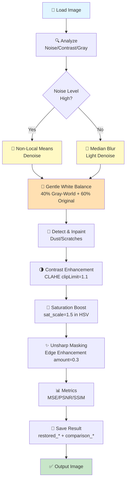

# 🖼️ Color Restoration of Old and Damaged Photographs

Advanced Digital Image Processing (DIP) pipeline to restore faded, noisy, or dust‑spotted historical photographs using OpenCV and NumPy.

---

## 📋 Table of Contents

1. [What This Project Does](#what-this-project-does)
2. [Quick Start](#quick-start)
3. [Project Structure](#project-structure)
4. [Complete Pipeline Flowchart](#complete-pipeline-flowchart)
5. [Algorithms & Methods](#algorithms--methods)
6. [Detailed Algorithm Explanations](#detailed-algorithm-explanations)
7. [Usage Examples](#usage-examples)
8. [Parameter Tuning Guide](#parameter-tuning-guide)
9. [Performance Tips](#performance-tips)
10. [Troubleshooting](#troubleshooting)
11. [Extensions & Improvements](#extensions--improvements)
12. [Release Checklist](#release-checklist)

---

## What This Project Does

🎯 **Input:** Scanned/photographed old images (jpg, png, bmp, tiff)  
📁 **Input Folder:** `dataset/old_images/`  
🎨 **Processing:** Classical DIP pipeline (denoising, gentle white balance, spot removal, contrast, saturation, unsharp masking)  
💾 **Output Folder:** `results/restored_images/`  
🖼️ **Comparison Saved:** `results/restored_images/comparison_{name}` — side-by-side original vs restored  
📊 **Metrics:** MSE, PSNR, SSIM quality assessment

**Core Techniques:**
- Non‑Local Means denoising (photographic noise)
- Gentle Gray‑World white balance blend (preserves warm tones of old photos)
- Spot detection + Telea inpainting (dust removal)
- CLAHE (local contrast enhancement, tuned to avoid over-darkening)
- Saturation boost (revive faded colors)
- Unsharp masking (detail/edge enhancement — only sharpening method used)
- Multi‑Scale Retinex — available but optional

---

## Quick Start

### Installation

```bash
pip install -r requirements.txt
```

### Run Interactive (displays original vs restored side-by-side)

```powershell
python main.py
```

### Run Headless (recommended for batch processing)

```powershell
python main.py --no-display
```

### Custom Input/Output Folders

```powershell
python main.py --input-dir C:\path\to\images --output-dir C:\path\to\output --no-display
```

---

## Project Structure

```
color_restoration_project/
├── main.py                      # Batch orchestration & CLI
├── restoration.py               # Core algorithms & helpers
├── requirements.txt             # Dependencies
├── README.md                    # This file
├── dataset/
│   └── old_images/             # Place input images here
├── results/
│   └── restored_images/        # restored_* and comparison_* saved here
└── models/                      # (Reserved for ML models)
```

---

## Complete Pipeline Flowchart

### ASCII Flow Diagram

```
┌─────────────────────────────────────────────────────────────────┐
│                      INPUT: Old Image                           │
└────────────────────────┬────────────────────────────────────────┘
                         │
                         ▼
        ┌────────────────────────────────┐
        │  IMAGE ANALYSIS (Detect Type)  │
        │  • estimate_noise()            │
        │  • is_grayscale()              │
        │  • contrast_score()            │
        └────────┬───────────────────────┘
                 │
        ┌────────▼────────────┐
        │  NOISE LEVEL HIGH?  │
        └────────┬────────────┘
                 │
        ┌────────┴─────────────────────┐
        │                              │
    YES │                              │ NO
        │                              │
        ▼                              ▼
    ┌──────────────────┐         ┌──────────────┐
    │ Non-Local Means  │         │ Median Blur  │
    │ Denoise (NLM)    │         │              │
    └──────┬───────────┘         └────────┬─────┘
        │                              │
        └────────────┬─────────────────┘
                     │
                     ▼
        ┌──────────────────────────────────────┐
        │  WHITE BALANCE (Gentle Blend)        │
        │  40% Gray-World + 60% Original       │
        │  Preserves warm sepia tones          │
        └────────┬─────────────────────────────┘
                 │
                 ▼
        ┌──────────────────────────────┐
        │  SPOT DETECTION + INPAINTING │
        │  (Detect small defects)      │
        │  (Inpaint with Telea)        │
        └────────┬─────────────────────┘
                 │
        ┌────────▼──────────────────┐
        │  CONTRAST ENHANCEMENT     │
        │  CLAHE clipLimit=1.1      │
        │  (subtle, no darkening)   │
        └────────┬───────────────────┘
                 │
                 ▼
        ┌──────────────────────────┐
        │  SATURATION BOOST        │
        │  sat_scale = 1.5         │
        │  (Scale S in HSV)        │
        └────────┬─────────────────┘
                 │
                 ▼
        ┌──────────────────────────────┐
        │  UNSHARP MASKING             │
        │  Detail/Edge Enhancement     │
        │  unsharp_amount = 0.3        │
        └────────┬─────────────────────┘
                 │
                 ▼
        ┌──────────────────────────┐
        │  COMPUTE METRICS         │
        │  MSE / PSNR / SSIM       │
        └────────┬─────────────────┘
                 │
                 ▼
        ┌──────────────────────────────────────┐
        │  SAVE + LOG RESULTS                  │
        │  restored_{name} + comparison_{name} │
        └────────┬─────────────────────────────┘
                 │
                 ▼
┌─────────────────────────────────────────────────────────────────┐
│   OUTPUT: restored_{original_name} + comparison_{original_name} │
└─────────────────────────────────────────────────────────────────┘
```

### Mermaid Diagram



---

## Algorithms & Methods

### 1️⃣ Image Analysis (Decision Making)

Determines image condition and processing strategy.

| Algorithm | Function | Input | Output | Purpose |
|-----------|----------|-------|--------|---------|
| **Noise Estimation** | `estimate_noise()` | Grayscale image | Float (stddev) | Decide between NLM vs Median |
| **Grayscale Detection** | `is_grayscale()` | BGR image | Boolean | Detect B/W or faded photos |
| **Contrast Score** | `contrast_score()` | BGR image | Float (stddev) | Assess brightness variation |

---

### 2️⃣ Denoising

Removes photographic or film grain noise while preserving detail.

#### Non-Local Means (NLM)
- **Class:** Patch-based denoising
- **OpenCV:** `fastNlMeansDenoisingColored()`
- **Function:** `nl_means_denoise()`
- **Best for:** Real photographic grain, film noise
- **Key Params:**
  - `h` = filter strength (luminance), default **6**
  - `hColor` = color strength, default **6**
  - Larger `h` = stronger smoothing (risk: plastic look)

#### Median Blur
- **Class:** Morphological filtering
- **OpenCV:** `cv2.medianBlur()`
- **Best for:** Salt-and-pepper noise, light specks
- **Key Params:**
  - `k` = kernel size (odd), default **3**

#### Bilateral Filter (Available, Optional)
- **Class:** Edge-preserving smoothing
- **Function:** `remove_noise()`
- **Best for:** Moderate noise + edge preservation
- **Note:** Not used in main pipeline by default

**Decision Rule:**
```
if estimate_noise(img) > noise_thresh (10.0):
    denoise = nl_means_denoise(img, h=6)
else:
    denoise = cv2.medianBlur(img, k=3)
```

---

### 3️⃣ Dust & Scratch Removal

Detects and inpaints small defects (dust, scratches, spots).

#### Spot Detection
- **Algorithm:** Residual thresholding + morphological cleanup
- **Function:** `detect_spots_mask()`
- **Method:**
  1. Apply median blur to grayscale
  2. Compute residual = |original – blurred|
  3. Threshold residual (param: `spot_thresh = 50`)
  4. Morphological open (remove noise)
  5. Dilate (expand mask)
- **Output:** Binary mask of defects

#### Inpainting
- **Algorithm:** Telea (fast marching)
- **OpenCV:** `cv2.inpaint(..., cv2.INPAINT_TELEA)`
- **Function:** `inpaint_spots()`
- **Best for:** Small defects (< 1-2% of image)
- **Limitation:** Large tears → use deep inpainting (LaMa)

**Key Params (current tuned values):**
- `spot_thresh` = 50
- `spot_blur` = 9
- `inpaint_radius` = 2

---

### 4️⃣ Color Correction (White Balance) — Gentle Blend

Removes global color casts while **preserving the natural warm tone** of old sepia/faded photographs.

#### Why Gentle Blend?
Full Gray-World white balance strips the warm brown/sepia tones from old photos, making them look cold and grey. The current pipeline uses a **60/40 blend** to partially correct color cast while keeping warmth:

```python
wb = white_balance_grayworld(denoise)
result = cv2.addWeighted(denoise, 0.6, wb, 0.4, 0)
# 60% original warmth + 40% white balanced = gentle correction
```

#### Gray-World Algorithm
- **Assumption:** Average scene color should be neutral gray
- **Function:** `white_balance_grayworld()`
- **Method:**
  1. Compute per-channel means (B, G, R)
  2. Compute overall luminance mean
  3. Scale each channel: `channel *= (luminance_mean / channel_mean)`
- **Pros:** Simple, robust for mild casts
- **Cons:** Strips warmth from naturally warm/sepia photos — use blend

#### LAB Space Correction (Available, Optional)
- **Function:** `white_balance()`
- **Method:**
  1. Convert BGR → LAB
  2. Shift a/b channels so means = 128 (neutral)
  3. Convert back to BGR
- **Note:** Available in restoration.py but not used in main pipeline

---

### 5️⃣ Contrast Enhancement

Improves local contrast for faded images without over-darkening backgrounds.

#### CLAHE (Contrast Limited Adaptive Histogram Equalization)
- **Applied on:** L channel (LAB color space)
- **Current tuned value:** `clipLimit = 1.1` (subtle, safe)
- **Method:**
  1. Convert BGR → LAB, extract L channel
  2. Apply CLAHE with `clipLimit=1.1` and `tileGridSize=(8,8)`
  3. Merge modified L back, convert to BGR
- **Pros:** Local detail preservation, no global over-stretch
- **Why 1.1?** Higher values (1.5+) darken wooden table backgrounds and wash out bright paper areas in old photos

#### Multi-Scale Retinex with Color Restoration (MSRCR) — Optional
- **Functions:** `single_scale_retinex()`, `multi_scale_retinex()`, `msrcr()`
- **Usage:** Via `restore_image_msr_wrapper(..., msr=True)`
- **Note:** Available but not called in main pipeline by default

---

### 6️⃣ Color Enhancement

Revives faded chroma (saturation).

#### Saturation Boost
- **Space:** HSV (Hue, Saturation, Value)
- **Function:** `increase_saturation()`
- **Current tuned value:** `sat_scale = 1.5`
- **Method:**
  1. Convert BGR → HSV
  2. Multiply S channel by `scale`
  3. Convert back to BGR
- **Why 1.5?** Old sepia photos have very low saturation — a strong boost is needed to make any visible color difference

---

### 7️⃣ Unsharp Masking

Enhances edge definition and fine detail by finding and boosting edges only.

#### How It Works
- **Method:** Blur the image slightly → subtract blurred from original → add the difference back
- **Formula:** `output = original + amount × (original – blurred)`
- **OpenCV:** `cv2.GaussianBlur()` + `cv2.addWeighted()`
- **Current tuned value:** `unsharp_amount = 0.3`
- **Caution:** High amounts → halos/ringing at edges

#### Code in `restoration.py`
```python
blurred = cv2.GaussianBlur(color, (0, 0), sigmaX=1.0)
sharpen = cv2.addWeighted(color, 1.0 + unsharp_amount, blurred, -unsharp_amount, 0)
# With unsharp_amount=0.3:
# output = (1.3 × original) - (0.3 × blurred)
# = original + 0.3 × (original - blurred)
# = original + 0.3 × edges_only
```

#### Why Unsharp Masking and not Laplacian Kernel?
Unsharp masking is the **only sharpening method used** in this pipeline. It was chosen because:
- Strength is fully controllable via `unsharp_amount`
- Gentle and natural — does not amplify noise
- Safe for old photos with existing grain/texture

---

### 8️⃣ Quality Metrics

Evaluate restoration quality (printed in logs after every image).

| Metric | Function | Range | Interpretation |
|--------|----------|-------|-----------------|
| **MSE** | `mse()` | 0–∞ | Lower = better (0 = identical) |
| **PSNR** | `psnr()` | 0–∞ dB | Higher = better (>20 dB acceptable) |
| **SSIM** | `ssim()` | -1 to 1 | Higher = better (>0.8 good) |

---

## Detailed Algorithm Explanations

### Non-Local Means Denoising Deep Dive

**Intuition:** Instead of smoothing locally (like Gaussian), find similar patches across the entire image and average them.

**Algorithm:**
1. For each pixel `p`:
   - Extract a template patch around `p` (e.g., 7×7)
   - Search for similar patches in a large window (e.g., 21×21)
   - Compute Euclidean distances to all patches
   - Weight patches inversely by distance: `w = exp(-dist² / h²)`
   - Denoise `p` = weighted average of all similar patches
2. `h` controls the decay of weights (filter strength)

**Tuning Guide:**
- Small images or light noise: `h` = 6–8
- Medium images, moderate noise: `h` = 10–15
- Heavy grain/old film: `h` = 20–25

---

### CLAHE Deep Dive

**Intuition:** Apply histogram equalization locally (each 8×8 tile) to boost contrast without over-stretching globally.

**Algorithm:**
1. Divide image into grid (e.g., 8×8 tiles)
2. For each tile, compute histogram & cumulative distribution
3. **Limit clipping:** If histogram bins exceed threshold (`clipLimit`), redistribute excess
4. Apply cumulative distribution to pixels (equalization)
5. Interpolate across tile boundaries (smooth transitions)

**Effect:**
- Small `clipLimit` (1.0–1.2): Natural, subtle contrast — **recommended for old photos with dark backgrounds**
- Large `clipLimit` (2.5–3.0): Heavy local detail, risk amplifying noise and darkening backgrounds
- Larger tiles (16×16): Smoother but less local; smaller (4×4): More detail but potential artifacts

---

### Telea Inpainting Deep Dive

**Intuition:** Use fast marching algorithm to propagate texture/color from boundaries into holes.

**Algorithm:**
1. Identify mask boundary (hole edges)
2. Iteratively expand inpainting from boundary inward
3. For each pixel to inpaint, estimate value from nearby frontier pixels
4. Use edge-preserving interpolation (prefers aligned gradients)

**Best for:** Small holes, smooth regions  
**Poor for:** Large complex structures, fine textures

---

### White Balance Blend — Why Not Full Gray-World?

Old photographs like sepia prints or faded paper photos have a **naturally warm brownish tone**. Full Gray-World white balance treats this warmth as a "color cast" and removes it, turning the image grey and cold.

The solution used in this pipeline is a **partial blend**:

```python
wb = white_balance_grayworld(denoise)               # fully corrected (cold)
result = cv2.addWeighted(denoise, 0.6, wb, 0.4, 0)  # 60% original + 40% corrected
```

This removes some unwanted color cast while keeping the warm character of the original photo.

---

## Usage Examples

### Example 1: Process Batch Headless

```powershell
python main.py --no-display
```

**Output:**
```
[INFO] Input folder: ...dataset\old_images
[INFO] Output folder: ...results\restored_images
[INFO] Processing: ...dataset\old_images\photo1.jpg
[INFO] Detected condition: Noisy + Low-Contrast
[INFO] Noise level: 15.32, Contrast score: 28.50
[INFO] MSE: 456.78, PSNR: 21.53, SSIM: 0.8756
[INFO] Saved restored image (mild) to: ...results\restored_images\restored_photo1.jpg
```

**Files saved to output folder:**
- `restored_photo1.jpg` — the restored image only
- `comparison_photo1.jpg` — side-by-side original vs restored (saved automatically)

### Example 2: Process Custom Folder

```powershell
python main.py --input-dir "D:\old_photos" --output-dir "D:\restored" --no-display
```

### Example 3: Interactive Display

```powershell
python main.py
```

Shows side-by-side comparison (14×7 figure, same scale for both images). Also saves `comparison_{name}` to the output folder automatically.

---

## Parameter Tuning Guide

### Current Tuned Values (main.py)

These values were tuned specifically for warm-toned old sepia/faded photographs:

```python
mild_params = dict(
    nlm_h=6,                # Gentle denoising — avoids plastic look
    median_k=3,             # Small kernel for light images
    clahe_clip=1.1,         # Low contrast boost — prevents background darkening
    sat_scale_override=1.5, # Strong saturation — old photos need this
    unsharp_amount=0.3,     # Moderate sharpening — crisp but not harsh
    spot_thresh=50,         # Conservative spot detection
    spot_blur=9,            # Median kernel for spot detection
    spot_min_frac=1e-4,     # Minimum spot coverage to trigger inpainting
    inpaint_radius=2,       # Small inpaint radius for fine spots
)
mild_variant = restore_image(img, sat_scale=1.5, **mild_params)
```

### Quick Reference Table

| Parameter | Range | Current Value | Effect |
|-----------|-------|---------------|--------|
| `nlm_h` | 6–25 | **6** | Denoising strength (↑ = stronger) |
| `median_k` | 3–9 | **3** | Median kernel (↑ = more aggressive) |
| `clahe_clip` | 1.0–3.0 | **1.1** | Local contrast (↑ = stronger, risk darkening) |
| `sat_scale` | 1.0–1.8 | **1.5** | Saturation (↑ = more vivid color) |
| `unsharp_amount` | 0.1–0.7 | **0.3** | Sharpening (↑ = more detail) |
| `spot_thresh` | 20–60 | **50** | Spot sensitivity (↓ = detect more spots) |

### Tuning Workflow

1. **Analyze image:** Run `analyze_and_restore()` to check noise/contrast levels
2. **Small batch downscale:** Process at 50% resolution for quick feedback
3. **Adjust one param at a time:** Change `nlm_h`, then `clahe_clip`, etc.
4. **Visual inspection:** Check `comparison_{name}` saved in output folder
5. **Metrics check:** Compare MSE/PSNR/SSIM in logs (relative, not absolute)
6. **Full resolution:** Reprocess at original size with best params

### Common Scenarios

#### Scenario: Warm Sepia / Old Paper Photo (current default)
```python
mild_params = dict(nlm_h=6, clahe_clip=1.1, sat_scale_override=1.5, unsharp_amount=0.3, ...)
# White balance blend in restoration.py: 60% original + 40% gray-world
```

#### Scenario: Very Noisy Old Photo
```python
restore_image(img, nlm_h=20, clahe_clip=1.1, unsharp_amount=0.3, sat_scale=1.5)
```

#### Scenario: Extremely Faded / Washed Out Photo
```python
restore_image(img, nlm_h=10, clahe_clip=1.5, sat_scale=1.6, unsharp_amount=0.4)
```

#### Scenario: Slightly Yellowed Photo
```python
# In restoration.py, increase white balance blend:
result = cv2.addWeighted(denoise, 0.3, wb, 0.7, 0)
restore_image(img, nlm_h=6, clahe_clip=1.2, sat_scale=1.3)
```

---

## Performance Tips

### Speed Optimizations

1. **Downscale & Parameter Search**
   ```python
   small = cv2.resize(img, (img.shape[1]//2, img.shape[0]//2))
   restored_small = restore_image(small, nlm_h=6, clahe_clip=1.1)
   ```

2. **Batch Processing (Parallel)**
   ```python
   from multiprocessing import Pool
   with Pool(4) as p:
       p.map(process_single_image, image_list)
   ```

3. **NLM Performance**
   - NLM is the slowest step (~80% of runtime)
   - Use smaller `templateWindowSize` (5 instead of 7) for speed
   - Consider lightweight GPU denoisers (FFDNet, DnCNN) for large batches

### Memory Efficiency

- Large images (4K+): Process in blocks or downscale
- Use `uint8` (not float32) for storage to save 4× memory

---

## Troubleshooting

### Issue: Output looks grey/cold (warmth stripped)

**Cause:** White balance blend ratio too aggressive  
**Fix:** In `restoration.py`, increase original weight:
```python
result = cv2.addWeighted(denoise, 0.7, wb, 0.3, 0)
```

### Issue: Background (table/wall) too dark

**Cause:** CLAHE `clipLimit` too high  
**Fix:**
```python
clahe_clip=1.0
```

### Issue: Output looks over-smoothed/plastic

**Cause:** NLM `h` too high  
**Fix:**
```python
restore_image(img, nlm_h=6, clahe_clip=1.1, unsharp_amount=0.3)
# unsharp_amount=0.3 adds back edge detail gently
```

### Issue: Restoration barely visible

**Cause:** Parameters too conservative  
**Fix:**
```python
sat_scale_override=1.5
clahe_clip=1.3
# In restoration.py:
result = cv2.addWeighted(denoise, 0.5, wb, 0.5, 0)
```

### Issue: Noise amplified after CLAHE

**Cause:** Heavy local contrast amplifies residual noise  
**Fix:**
```python
restore_image(img, nlm_h=15, clahe_clip=1.0)
```

### Issue: Color shift or oversaturation

**Cause:** `sat_scale` too high  
**Fix:**
```python
sat_scale=1.3
```

### Issue: Inpainting leaves artifacts

**Cause:** Defect mask too large or Telea limitation  
**Fix:** Reduce `spot_thresh` or use deep inpainting (LaMa)

### Issue: Script crashes on corrupted image

**Fix:** Already handled with per-image try/except. Check logs for which file failed.

---

## Extensions & Improvements

### 1. Replace NLM with Learned Denoiser

**Options:** FFDNet, DnCNN, Real-ESRGAN

```python
if use_learned_denoiser:
    denoise = ffdnet_denoise(img, noise_sigma)
else:
    denoise = nl_means_denoise(img, h=nlm_h)
```

### 2. Colorization for B&W Photos

**Options:** DeOldify, user-guided colorization

```python
if is_grayscale(img) and colorize_enabled:
    img = colorize_image(img)
```

### 3. Super-Resolution

**Options:** Real-ESRGAN (2–4×), BSRGAN

```python
if enable_sr:
    restored = super_resolve(restored, scale=2)
```

### 4. Deep Inpainting (Large Defects)

**Options:** LaMa, Partial Convolution

```python
if defect_size > threshold:
    restored = lama_inpaint(restored, large_mask)
else:
    restored = cv2.inpaint(restored, small_mask, INPAINT_TELEA)
```

### 5. Adaptive White Balance Blend

```python
# Future: auto-detect warmth and adjust blend ratio
warmth = detect_warmth(img)
blend_ratio = max(0.3, min(0.7, warmth))
result = cv2.addWeighted(denoise, blend_ratio, wb, 1-blend_ratio, 0)
```

---

## Release Checklist

- [x] Core pipeline (denoising, white balance, CLAHE, saturation, unsharp masking)
- [x] Gentle white balance blend (60% original + 40% gray-world) to preserve warm tones
- [x] Tuned parameters for sepia/faded old photographs
- [x] Per-image error handling & logging
- [x] CLI flags (`--no-display`, `--input-dir`, `--output-dir`)
- [x] Single canonical output per image (`restored_{name}`)
- [x] Comparison image saved automatically (`comparison_{name}`)
- [x] Side-by-side display uses `mild_variant` from memory (not re-reading disk)
- [x] Same-scale display for both original and restored images
- [x] Quality metrics (MSE/PSNR/SSIM)
- [x] Enhanced README with flowcharts & detailed explanations
- [ ] Add `--preset` flag to choose presets (balanced/aggressive/msr)
- [ ] Add `--verbose` logging level
- [ ] Add unit tests for helpers
- [ ] Add sample images to `dataset/example/`
- [ ] Add GPU support (optional, for CUDA)
- [ ] Parallelize batch processing (`--jobs` flag)
- [ ] Adaptive white balance blend ratio based on image warmth

---

## Contact & Credits

**Dependencies:**
- OpenCV (`opencv-python`)
- NumPy (`numpy`)
- Matplotlib (`matplotlib`)

**References:**
- Non-Local Means: Buades et al., 2005
- CLAHE: Zuiderveld, 1994
- Retinex: Land & McCann, 1971
- Telea Inpainting: Telea, 2004

---

**Last Updated:** March 26, 2026

For questions or improvements, refer to the [usage examples](#usage-examples) or [parameter tuning guide](#parameter-tuning-guide).