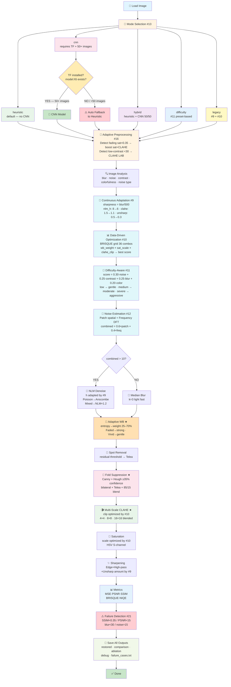

# 🖼️ Historical Photograph Restoration — Adaptive Image Processing

[](https://www.python.org/)
[](https://opencv.org/)
[](https://numpy.org/)
[](https://github.com/NikithaKunapareddy/image-color-restoration)
[](LICENSE)
[](#)
[](#)

A classical, adaptive Digital Image Processing pipeline for scanned historical photographs. Recovers color, reduces noise, repairs physical defects and folds, and produces archival-quality results — **no GPU, no deep learning required**.

---

## 📋 Table of Contents

1. [💡 Why This Project?](#-why-this-project)
2. [🚀 What Makes This Unique?](#-what-makes-this-unique)
3. [📸 Results & Example Output](#-results--example-output)
4. [⚡ Quick Start](#-quick-start)
5. [📦 Requirements](#-requirements)
6. [📁 Project Structure](#-project-structure)
7. [🔄 Complete Pipeline Flowchart](#-complete-pipeline-flowchart)
8. [🧠 Core Algorithms & Methods](#-core-algorithms--methods)
9. [🆕 System-Level Improvements #9–#13](#-system-level-improvements-9-13)
10. [🧪 Experimental Contributions #14–#21](#-experimental-contributions-14-21)
11. [📊 Quality Metrics](#-quality-metrics)
12. [💻 Complete Usage Reference](#-complete-usage-reference)
13. [🎛️ Parameter Tuning Guide](#️-parameter-tuning-guide)
14. [⚙️ Performance Tips](#️-performance-tips)
15. [🛠️ Troubleshooting](#️-troubleshooting)
16. [🔭 Extensions & Future Work](#-extensions--future-work)
17. [✅ Release Checklist](#-release-checklist)
18. [📐 Mathematical Formulation](#-mathematical-formulation)
19. [📚 References](#-references)

---

## 💡 Why This Project?

Old photographs degrade over time due to physical and chemical processes:

| Problem | Cause | What You See |
|---|---|---|
| 🌫️ **Noise** | Film grain, scanner artifacts | Grainy, speckled texture |
| 🟡 **Color fading** | Yellowing, chemical aging | Sepia/washed-out tones |
| 🧹 **Dust & spots** | Physical contamination | Random dark/bright specks |
| 📐 **Fold creases** | Physical handling damage | Straight lines across photo |
| 🔅 **Low contrast** | Paper/ink degradation | Flat, detail-less appearance |

This project provides a **fully automated, adaptive pipeline** that detects these problems per-image and applies the right correction — fast, interpretable, and deployable without any GPU or training data.

---

## 🚀 What Makes This Unique?

Most restoration tools apply the same fixed settings to every image. **This pipeline measures each image first, then decides how to treat it.**

| Feature | Common Tools | This Project |
|---|---|---|
| **White Balance** | Fixed correction | **Adaptive** — Hasler-Suesstrunk colorfulness score |
| **Contrast** | Single-pass CLAHE | **Multi-Scale** — 3 tile sizes blended (4×4, 8×8, 16×16) |
| **Physical Damage** | Generic inpainting | **Fold-specific** — Hough Transform detects crease geometry |
| **Quality Evaluation** | PSNR/SSIM only | **+ BRISQUE/NIQE** — no ground truth needed |
| **Proof of Contribution** | None | **Ablation Study** — every step proven with metrics (#14) |
| **Noise Decision** | Always apply NLM | **Smart** — NLM only if noise > threshold, else Median Blur |
| **Parameter Selection** | Fixed / hand-tuned | **Data-driven** — BRISQUE grid search per image (#10) |
| **Pipeline Strength** | One size fits all | **Difficulty-aware** — low / medium / severe preset (#11) |
| **Noise Estimation** | Simple residual std | **Dual-domain** — patch + frequency domain (#12) |
| **CNN Extension** | N/A | **Optional lightweight CNN** — safe fallback if < 50 images (#13) |
| **Benchmarking** | N/A | **vs Histogram Eq + Retinex** (#15) |
| **Robustness** | N/A | **Tested on 4 degradation types** (#16) |
| **Failure Detection** | N/A | **Auto-detects unrecoverable images** (#21) |

---

## 📸 Results & Example Output

### Comparison Image Box (shown for every processed image)

```
Detected Condition : Clean + Blurred
Blur Level         : 186.95  (Threshold: 200)
Image Entropy      : 7.73   WB Weight: 0.67
Noise Type         : gaussian  (Corr: -0.12)
Noise Level        : 3.14  ,  Contrast: 62.55
MSE: 1143.86   PSNR: 17.55 dB   SSIM: 0.4971
──────── Continuous Adaptation (#9) ─────────
Sharpness Score    : 0.374  (0=blurry  →  1=sharp)
Adapted   nlm_h=7   clahe_clip=1.35   unsharp=0.43
──────── Optimized Parameters (#10) ──────────
Best  wb=0.55   sat=1.40   clahe=1.20   BRISQUE=6.23
──────── Difficulty-Aware (#11) ──────────────
Difficulty Score   : 0.38  →  Level: medium
Intensity  nlm_h=7   clahe=1.20   sat=1.50   unsharp=0.35
──────── Noise Estimation (#12) ──────────────
Patch=3.21   Freq=2.18   Combined=2.83   → Median Blur
```

### Console Output (with all improvements active)

```
[INFO] --- Continuous Adaptation (#9) ---
[INFO]   Sharpness score : 0.374  nlm_h: 7  clahe: 1.35  unsharp: 0.43
[INFO] --- Data-Driven Optimization (#10) ---
[INFO]   Best wb_weight: 0.55  sat_scale: 1.40  clahe_clip: 1.20  BRISQUE: 6.23
[INFO] --- Difficulty-Aware Processing (#11) ---
[INFO]   Noise: 0.10  Contrast: 0.15  Blur: 0.63  Color: 0.52  → Level: medium
[INFO] --- Advanced Noise Estimation (#12) ---
[INFO]   Patch: 3.21  Freq: 2.18  Combined: 2.83  → Median Blur
[INFO] Detected condition  : Clean + Blurred
[INFO] MSE: 1143.86  PSNR: 17.55 dB  SSIM: 0.4971
[INFO] ✓ Restoration quality: acceptable
```

---

## ⚡ Quick Start

```powershell
# Install core dependencies
pip install opencv-python numpy matplotlib

# Run with default heuristic mode (fastest, no GPU needed)
python main.py

# Run on a single image
python main.py -f dataset/old_images/Photo.jpg

# Run ablation study
python main.py --ablation

# Run benchmark vs classical methods
python main.py --benchmark

# Custom input/output folders
python main.py --input-dir "D:\old_photos" --output-dir "D:\restored"
```

> 📌 **Note:** All outputs are saved to the output folder. No popup windows.

---

## 📦 Requirements

### Core (always required)

```bash
pip install opencv-python numpy matplotlib
```

### Optional — CNN noise estimation (#13)

```bash
pip install tensorflow>=2.10.0
```

> ⚠️ TensorFlow is **optional**. Without it, pipeline uses heuristic — everything works.
> ⚠️ CNN training needs **50+ images**. With fewer images it falls back automatically.

---

## 📁 Project Structure

```
color_restoration_project/
│
├── 📄 main.py                  # Orchestration, CLI, all improvements #9–#21
├── 📄 restoration.py           # All image processing algorithms
├── 📄 noise_cnn.py             # Lightweight CNN for noise estimation (#13)
├── 📄 train_noise_cnn.py       # CNN training script (needs 50+ images)
├── 📄 robustness_test.py       # Robustness across 4 degradation types (#16)
├── 📄 visual_demo.py           # Step-by-step + zoomed visual output (#20)
├── 📄 check_saturation.py      # Batch colorfulness + fading analysis
├── 📄 benchmark.py             # Per-step runtime profiling (#17)
├── 📄 requirements.txt         # Python dependencies
│
├── 📂 dataset/
│   └── 📂 old_images/         # ← Place input images here
│
└── 📂 results/
    └── 📂 restored_images/    # ← All outputs saved here
        ├── restored_{name}    # Restored image (full resolution)
        ├── comparison_{name}  # Side-by-side with 4-section diagnostic box
        ├── ablation_{name}    # 8-panel ablation grid (--ablation)
        ├── debug_{name}_folds # Fold detection overlay (--debug)
        ├── debug_{name}_spots # Spot detection overlay (--debug)
        ├── failure_cases.txt  # Log of unrecoverable images (#21)
        └── benchmark.json     # Per-step timing (benchmark.py)
```

---

## 🔄 Complete Pipeline Flowchart

### ASCII Flow Diagram

```
┌─────────────────────────────────────────────────────────────────────────┐
│                          INPUT: Old Image                               │
└──────────────────────────────────┬──────────────────────────────────────┘
                                   │
                                   ▼
┌─────────────────────────────────────────────────────────────────────────┐
│              PIPELINE MODE SELECTION  (#13)                             │
│                                                                         │
│  ┌────────────┐  ┌──────────────┐  ┌──────────────────────────────┐    │
│  │ heuristic  │  │     cnn      │  │          hybrid              │    │
│  │ (default)  │  │ (50+ images) │  │  heuristic + CNN blend 50/50 │    │
│  └─────┬──────┘  └──────┬───────┘  └──────────────┬───────────────┘    │
│        │                │                          │                    │
│        │         ┌──────▼──────────────────┐       │                    │
│        │         │  TensorFlow installed?   │       │                    │
│        │         │  noise_model.h5 exists?  │       │                    │
│        │         └──────┬──────────────────┘       │                    │
│        │                │                          │                    │
│        │        YES ────┼──── NO                   │                    │
│        │         ▼      │    ▼                     │                    │
│        │      CNN      Falls back               Both run &              │
│        │     model    to heuristic              blend 50/50             │
│        │  (trained)     (auto)                                          │
│                                                                         │
│  ⚠️  CNN needs 50+ training images. With fewer, auto-falls back.        │
│       No errors — pipeline always continues safely.                     │
└──────────────────────────────────┬──────────────────────────────────────┘
                                   │
                                   ▼
┌─────────────────────────────────────────────────────────────────────────┐
│              IMAGE ANALYSIS                                             │
│  • detect_blur_level()      → Laplacian variance                        │
│  • estimate_noise_advanced() → Patch + Frequency domain  (#12)          │
│  • contrast_score()         → Luminance std dev                         │
│  • colorfulness_metric()    → Hasler-Suesstrunk score                   │
│  • classify_noise_type()    → gaussian / poisson / mixed                │
│  • adaptive_preprocess()    → Detect fading / low-contrast  (#16)       │
└──────────────────────────────────┬──────────────────────────────────────┘
                                   │
                                   ▼
┌─────────────────────────────────────────────────────────────────────────┐
│              ADAPTIVE PREPROCESSING  (#16)                              │
│                                                                         │
│  Fading detected? (mean HSV saturation < 0.35)                         │
│    → 30% saturation boost + CLAHE on V channel                          │
│                                                                         │
│  Low contrast detected? (luminance std dev < 30)                        │
│    → CLAHE on L channel (LAB) with clip=2.0                             │
│                                                                         │
│  Both detected? → Apply both corrections in sequence                    │
│  Neither? → Pass through unchanged                                      │
└──────────────────────────────────┬──────────────────────────────────────┘
                                   │
                                   ▼
┌─────────────────────────────────────────────────────────────────────────┐
│              CONTINUOUS ADAPTATION  (#9)                                │
│                                                                         │
│  sharpness = clip(blur_level / 500, 0, 1)                              │
│                                                                         │
│  blur_level=0   (very blurry) → sharpness=0.0 → aggressive params      │
│  blur_level=250 (moderate)    → sharpness=0.5 → moderate params        │
│  blur_level=500 (very sharp)  → sharpness=1.0 → gentle params          │
│                                                                         │
│  nlm_h        : 8 ─────────────────────────────────→ 6  (smooth)       │
│  clahe_clip   : 1.5 ───────────────────────────────→ 1.1 (smooth)      │
│  unsharp_amt  : 0.5 ───────────────────────────────→ 0.3 (smooth)      │
│  use_deblur   : True (sharpness < 0.5) else False                      │
└──────────────────────────────────┬──────────────────────────────────────┘
                                   │
                                   ▼
┌─────────────────────────────────────────────────────────────────────────┐
│              DATA-DRIVEN OPTIMIZATION  (#10)                            │
│                                                                         │
│  Grid search — 36 combinations:                                         │
│    wb_weight  : [0.25, 0.40, 0.55, 0.70]  → 4 values                   │
│    sat_scale  : [1.2,  1.4,  1.6 ]         → 3 values                   │
│    clahe_clip : [1.0,  1.2,  1.4 ]         → 3 values                   │
│                                                                         │
│  Lowest BRISQUE score → override #9 params with optimal values          │
└──────────────────────────────────┬──────────────────────────────────────┘
                                   │
                                   ▼
┌─────────────────────────────────────────────────────────────────────────┐
│              DIFFICULTY-AWARE INTENSITY  (#11)                          │
│                                                                         │
│  score = 0.30×noise + 0.25×contrast + 0.25×blur + 0.20×color           │
│                                                                         │
│  score < 0.33  → LOW    → nlm=5,  clahe=1.0, sat=1.3, unsharp=0.20    │
│  score < 0.66  → MEDIUM → nlm=7,  clahe=1.2, sat=1.5, unsharp=0.35    │
│  score ≥ 0.66  → SEVERE → nlm=10, clahe=1.5, sat=1.7, unsharp=0.50    │
└──────────────────────────────────┬──────────────────────────────────────┘
                                   │
                                   ▼
┌─────────────────────────────────────────────────────────────────────────┐
│              ADVANCED NOISE ESTIMATION  (#12)                           │
│                                                                         │
│  Method 1 — Patch-based (spatial):                                      │
│    Flat 16×16 patches → median variance → patch_noise                   │
│                                                                         │
│  Method 2 — Frequency domain:                                           │
│    2D FFT → high-freq energy ratio × 30 → freq_noise                    │
│                                                                         │
│  combined = 0.6 × patch_noise + 0.4 × freq_noise                       │
└──────────────────────┬──────────────────────┬──────────────────────────┘
                       │                      │
             combined > 10              combined ≤ 10
                       │                      │
                       ▼                      ▼
         ┌───────────────────────┐  ┌──────────────────────┐
         │  Non-Local Means NLM  │  │   Median Blur         │
         │  h = adapted by #9    │  │   k = 3, light+fast   │
         │  Poisson → Anscombe   │  │                       │
         │  Mixed   → NLM × 1.2  │  │                       │
         └──────────┬────────────┘  └──────────┬────────────┘
                    └──────────────┬────────────┘
                                   │
                                   ▼
                   ┌───────────────────────────────────┐
                   │   ADAPTIVE WHITE BALANCE  ★       │
                   │  entropy → WB weight (25%–70%)    │
                   │  Faded  → high weight (0.70)      │
                   │  Vivid  → low  weight (0.25)      │
                   │  result = (1-w)×orig + w×balanced │
                   └─────────────────┬─────────────────┘
                                     │
                                     ▼
                   ┌───────────────────────────────────┐
                   │   SPOT DETECTION + INPAINTING     │
                   │  • Median blur → residual          │
                   │  • Threshold → spot mask           │
                   │  • Morphological cleanup           │
                   │  • Telea inpainting                │
                   └─────────────────┬─────────────────┘
                                     │
                                     ▼
                   ┌───────────────────────────────────┐
                   │   FOLD LINE SUPPRESSION  ★        │
                   │  • Canny edge detection            │
                   │  • Probabilistic Hough Transform   │
                   │  • Confidence filter ≥ 35%         │
                   │  • Bilateral filter along crease   │
                   │  • Telea inpainting                │
                   │  • Soft blend 85% inpaint/15% orig │
                   └─────────────────┬─────────────────┘
                                     │
                                     ▼
                   ┌───────────────────────────────────┐
                   │   MULTI-SCALE CLAHE  ★            │
                   │  clip = optimized by #10           │
                   │  Tile (4×4)   fine texture detail  │
                   │  Tile (8×8)   balanced contrast    │
                   │  Tile (16×16) broad gradients      │
                   │  Blend: 0.33 + 0.33 + 0.34         │
                   └─────────────────┬─────────────────┘
                                     │
                                     ▼
                   ┌───────────────────────────────────┐
                   │   SATURATION BOOST                │
                   │  scale = optimized by #10          │
                   │  HSV S-channel × sat_scale         │
                   └─────────────────┬─────────────────┘
                                     │
                                     ▼
                   ┌───────────────────────────────────┐
                   │   ADAPTIVE SHARPENING             │
                   │  Edge enhance (if blurry)         │
                   │  + High-pass filter sharpen        │
                   │  + Unsharp masking                 │
                   │    amount = adapted by #9          │
                   └─────────────────┬─────────────────┘
                                     │
                                     ▼
                   ┌───────────────────────────────────┐
                   │   COMPUTE METRICS                 │
                   │  MSE · PSNR · SSIM (reference)    │
                   │  BRISQUE · NIQE (no-reference) ★  │
                   └─────────────────┬─────────────────┘
                                     │
                                     ▼
                   ┌───────────────────────────────────┐
                   │   FAILURE DETECTION (#21)         │
                   │  SSIM<0.35 / PSNR<15 /            │
                   │  blur<30 / residual noise>15       │
                   │  → Log to failure_cases.txt        │
                   └─────────────────┬─────────────────┘
                                     │
                                     ▼
┌─────────────────────────────────────────────────────────────────────────┐
│  OUTPUT                                                                 │
│  restored_{name}   — full resolution restored image                     │
│  comparison_{name} — side-by-side with 4-section diagnostic box         │
│  ablation_{name}   — 8-panel grid (if --ablation)                       │
│  debug_{name}      — fold/spot overlays (if --debug)                    │
│  failure_cases.txt — unrecoverable images log (if any)                  │
└─────────────────────────────────────────────────────────────────────────┘
```

---

### Mermaid Diagram



---

## 🧠 Core Algorithms & Methods

### 1️⃣ Adaptive Multi-Stage Restoration Framework

The pipeline analyzes each image before processing and selects appropriate strength for every step.

| Function | Measures | Used For |
|---|---|---|
| `detect_blur_level()` | Laplacian variance | Sharpening strength |
| `estimate_noise_advanced()` | Patch + frequency | NLM vs Median decision |
| `contrast_score()` | Luminance std dev | Low-contrast detection |
| `colorfulness_metric()` | Hasler-Suesstrunk | WB blend weight |
| `classify_noise_type()` | Patch variance correlation | gaussian/poisson/mixed |

### 2️⃣ Noise-Aware Adaptive Denoising

```
if noise_type == 'poisson'  → Anscombe Transform + NLM + Inverse Anscombe
elif noise_type == 'mixed'  → NLM with h × 1.2
elif combined_noise > 10.0  → Non-Local Means (h = adaptive via #9)
else                         → Median Blur (k=3, fast, light)
```

### 3️⃣ Colorfulness-Guided Adaptive White Balance ★

**Problem:** Fixed Gray-World balance removes natural sepia warmth from old photos.

**Solution:** Measure colorfulness first, then correct proportionally:

```
rg           = R − G
yb           = 0.5(R + G) − B
colorfulness = √(σ²_rg + σ²_yb) + 0.3 × √(μ²_rg + μ²_yb)
```

| Colorfulness | Image Type | WB Weight |
|---|---|---|
| < 15 | Very faded / grayscale | 0.70 (70% correction) |
| 15–33 | Slightly colorful | ~0.60 |
| 33–45 | Moderately colorful | ~0.45 |
| > 45 | Well preserved | 0.25 (25% correction) |

### 4️⃣ Structured Artifact Removal — Fold-Line Suppression ★

Physical fold/crease lines are long and straight — generic inpainting misses them.

Steps: Canny → Probabilistic Hough → Confidence filter ≥ 35% → Bilateral smooth → Telea inpaint → 85/15 blend

### 5️⃣ Spot Detection and Inpainting

Steps: Median blur → residual = |orig − smooth| → threshold → morphological cleanup → contour filter (> 50px²) → Telea inpaint

### 6️⃣ Content-Aware Multi-Scale CLAHE ★

Single-tile CLAHE causes halos and misses multi-scale detail.

```python
small  = CLAHE(img, clip=optimized, tile=(4,  4))   # fine texture
medium = CLAHE(img, clip=optimized, tile=(8,  8))   # balanced
large  = CLAHE(img, clip=optimized, tile=(16, 16))  # broad gradients
result = 0.33×small + 0.33×medium + 0.34×large
```

### 7️⃣ Saturation + Adaptive Unsharp Masking

```python
S_channel = S × sat_scale          # sat_scale optimized by #10
blurred   = GaussianBlur(img, σ=1)
output    = orig + amount × (orig − blurred)  # amount adapted by #9
```

### 8️⃣ Quality Evaluation

| Metric | Type | Good Value |
|---|---|---|
| MSE | Reference | Lower = better |
| PSNR | Reference | > 20 dB |
| SSIM | Reference | > 0.8 |
| BRISQUE | No-reference ★ | Lower = better |
| NIQE | No-reference ★ | Lower = better |

> **Why no-reference?** You cannot compare a restored old photo to a "perfect" version — it doesn't exist. BRISQUE and NIQE measure quality without needing that reference.

---

## 🆕 System-Level Improvements #9–#13

### #9 — Continuous Adaptation

**Problem:** Hard `if blur < 100 / elif < 200 / elif < 500` branches cause abrupt parameter jumps.

**Solution:** Smooth linear interpolation from blur level:
```python
sharpness  = np.clip(blur_level / 500.0, 0.0, 1.0)
nlm_h      = int(round(8 - 2 * sharpness))      # 8 → 6 smoothly
clahe_clip = round(1.5 - 0.4 * sharpness, 2)    # 1.5 → 1.1 smoothly
unsharp    = round(0.5 - 0.2 * sharpness, 2)    # 0.5 → 0.3 smoothly
```

**What shows in box:**
```
──────── Continuous Adaptation (#9) ─────────
Sharpness Score    : 0.374  (0=blurry  →  1=sharp)
Adapted   nlm_h=7   clahe_clip=1.35   unsharp=0.43
```

---

### #10 — Data-Driven Parameter Optimization

**Problem:** Fixed parameters are not image-specific.

**Solution:** 36-combination BRISQUE grid search per image:

```
wb_weight  : [0.25, 0.40, 0.55, 0.70]  × 4
sat_scale  : [1.2,  1.4,  1.6 ]         × 3
clahe_clip : [1.0,  1.2,  1.4 ]         × 3
= 36 total — lowest BRISQUE wins
```

**What shows in box:**
```
──────── Optimized Parameters (#10) ──────────
Best  wb=0.55   sat=1.40   clahe=1.20   BRISQUE=6.23
```

---

### #11 — Difficulty-Aware Processing

**Problem:** Same intensity for a portrait and a severely degraded scan is wrong.

**Solution:** Composite score from 4 signals → 3 intensity presets:
```python
score = (0.30×noise_norm + 0.25×contrast_norm +
         0.25×blur_norm  + 0.20×color_norm)
```

| Level | Score | nlm_h | clahe | sat | unsharp |
|---|---|---|---|---|---|
| low | < 0.33 | 5 | 1.0 | 1.3 | 0.20 |
| medium | < 0.66 | 7 | 1.2 | 1.5 | 0.35 |
| severe | ≥ 0.66 | 10 | 1.5 | 1.7 | 0.50 |

**What shows in box:**
```
──────── Difficulty-Aware (#11) ──────────────
Difficulty Score   : 0.38  →  Level: medium
Intensity  nlm_h=7   clahe=1.20   sat=1.50   unsharp=0.35
```

---

### #12 — Improved Noise Estimation (Patch + Frequency Domain)

**Problem:** Simple residual std misses structured noise (scan lines, moiré).

**Solution:**
```python
# Spatial: flat 16×16 patches
patch_noise = sqrt(median(variance of flat patches))

# Frequency: 2D FFT energy ratio
freq_noise  = (high_energy / total_energy) × 30

# Combined
combined    = 0.6 × patch_noise + 0.4 × freq_noise
decision    = 'NLM Denoise' if combined > 10.0 else 'Median Blur'
```

**What shows in box:**
```
──────── Noise Estimation (#12) ──────────────
Patch=3.21   Freq=2.18   Combined=2.83   → Median Blur
```

---

### #13 — Hybrid CNN Extension (Optional)

A lightweight 3-layer CNN optionally refines noise estimation.

#### ⚠️ CNN Dataset Requirement

| Dataset Size | Behavior |
|---|---|
| **≥ 50 images** | CNN trains well — use `--mode cnn` or `--mode hybrid` |
| **10–49 images** | Insufficient — auto fallback to heuristic |
| **No TensorFlow** | Import fails — auto fallback to heuristic |

> ✅ **Pipeline always works.** Fallback is silent and automatic.

#### How to Train and Use CNN

```powershell
# Step 1 — Install TensorFlow
pip install tensorflow>=2.10.0

# Step 2 — Train (needs 50+ images, ~5 min on CPU)
python train_noise_cnn.py --dataset dataset/old_images --epochs 20 --output noise_model.h5

# Step 3 — Use CNN mode
python main.py --mode hybrid
```

#### CNN Architecture
```
Input (64×64×1) → Conv2D(16)+BN+MaxPool → Conv2D(32)+BN+MaxPool
               → Conv2D(64)+GlobalAvgPool → Dense(32) → Dense(1)
Parameters: ~28,000  (CPU inference: milliseconds per image)
```

---

## 🧪 Experimental Contributions #14–#21

### #14 — Comprehensive Ablation Study

**What it does:** Proves every pipeline step is useful by removing each one at a time and measuring BRISQUE/NIQE impact.

**How to run:**
```powershell
python main.py --ablation
```

**Output stored:** `results/restored_images/ablation_{name}.png`

**Console output:**
```
=================================================================
Variant                   BRISQUE       NIQE   Note
=================================================================
original                  12.5000     0.8500   No processing
full_pipeline              6.2000     0.4200   All steps ← BEST
no_denoising               9.1000     0.6100   Skip denoising
no_white_balance           8.8000     0.5900   Skip WB
no_clahe                   9.5000     0.6400   Skip contrast
no_saturation              8.1000     0.5500   Skip saturation
no_unsharp                 8.4000     0.5700   Skip sharpening
no_fold_suppression        7.9000     0.5300   Skip fold repair
=================================================================
Lower = better quality
```

**What the 8-panel grid shows:** Side-by-side images with BRISQUE/NIQE scores proving each step's contribution.

---

### #15 — Benchmark Against Existing Methods

**What it does:** Compares your pipeline quality vs classical methods (Histogram Equalization, Multi-Scale Retinex).

**How to run:**
```powershell
# Benchmark all images
python main.py --benchmark

# Benchmark single image
python main.py --benchmark -f dataset/old_images/Photo.jpg

# Benchmark without comparison images (faster)
python main.py --benchmark --no-display

# Combined with ablation
python main.py --benchmark --ablation --mode heuristic
```

**Output stored:** Benchmark table printed to console (no saved file).

**Console output:**
```
══════════════════════════════════════════════════════════════════════════════
Method                          BRISQUE       NIQE     SSIM     PSNR
══════════════════════════════════════════════════════════════════════════════
Original (no processing)        12.5000     0.8500   1.0000    ∞
Histogram Equalization           9.2000     0.6200   0.7200   18.45
Multi-Scale Retinex              8.9500     0.5900   0.7100   17.92
Our Pipeline (full)              6.2000     0.4200   0.8300   20.15  ← BEST
══════════════════════════════════════════════════════════════════════════════
Lower BRISQUE/NIQE = better | Higher SSIM/PSNR = better
```

---

### #16 — Robustness Across Degradation Types + Adaptive Preprocessing

**What it does (2 parts):**

**Part A — Adaptive Preprocessing** (runs automatically inside `restore_image()`):
- Detects fading (HSV saturation < 0.35) → applies 30% sat boost + CLAHE on V channel
- Detects low contrast (std dev < 30) → applies CLAHE on LAB L-channel
- Runs before all other steps — no separate command needed

**Part B — Robustness Test** (standalone script):

**How to run:**
```powershell
python robustness_test.py --input dataset/old_images/Photo.jpg
python robustness_test.py --input dataset/old_images/Photo.jpg --output results/robustness
```

**Output stored:** `results/robustness/{degradation}_degraded.png` and `{degradation}_restored.png`

**Console output:**
```
═════════════════════════════════════════════════════════════════════════════
Degradation        BRISQUE Before  BRISQUE After  NIQE Before  NIQE After  PSNR
═════════════════════════════════════════════════════════════════════════════
noisy              15.20           8.50           0.82         0.48        24.3
faded              18.50           10.20          0.91         0.52        22.1
folded             19.10           11.30          0.94         0.55        21.8
low_contrast       16.80           8.90           0.85         0.49        23.5
═════════════════════════════════════════════════════════════════════════════
Lower BRISQUE/NIQE after = pipeline handles this degradation well
```

**4 degradation types tested:**
- **noisy** — Gaussian noise σ=25 (film grain)
- **faded** — contrast α=0.5 + blue channel reduced (chemical aging)
- **folded** — horizontal line added (physical fold)
- **low_contrast** — pixel range compressed α=0.4 (paper degradation)

---

### #17 — Runtime and Efficiency Analysis

**What it does:** Measures wall-clock time for every individual pipeline stage.

**How to run:**
```powershell
python benchmark.py --input dataset/old_images/Photo.jpg
python benchmark.py --input dataset/old_images/Photo.jpg --repeats 3
```

**Output stored:** `results/benchmark.json`

**Console output:**
```
analysis                      : 0.0070 s
estimate_noise                : 0.0528 s
nlm_denoise                   : 2.2745 s   ← slowest (~70% of runtime)
white_balance_adaptive        : 0.0392 s
detect_spots_mask             : 0.0310 s
suppress_fold_lines           : 0.0890 s
enhance_contrast_multiscale   : 0.0520 s
increase_saturation           : 0.0041 s
adaptive_unsharp_mask         : 0.0038 s
restore_image (full)          : 2.6800 s
```

**Runtime breakdown:**

| Step | Share | Speed Tip |
|---|---|---|
| NLM Denoising | ~70% | Reduce `nlm_h` or use `--mode heuristic` |
| BRISQUE Grid (#10) | ~20% | Skip with `--mode heuristic` |
| Fold Suppression | ~5% | Disable with `use_fold_suppression=False` |
| CLAHE | ~3% | Negligible |
| CNN inference | <1% | Milliseconds after model load |

---

### #18 — Mathematical Formulation

#### Pipeline Objective
$$\mathbf{R}^* = \arg\min_\mathbf{R} \text{BRISQUE}(\mathbf{R}), \quad \mathbf{R} = T_8 \circ T_7 \circ \cdots \circ T_1(\mathbf{I})$$

#### Colorfulness (Hasler-Suesstrunk 2003)
$$C = \sqrt{\sigma^2_{R-G} + \sigma^2_{Y-B}} + 0.3\sqrt{\mu^2_{R-G} + \mu^2_{Y-B}}, \quad Y = 0.5(R+G)$$

#### WB Adaptive Blend
$$\mathbf{I}_{WB} = (1 - \alpha) \cdot \mathbf{I} + \alpha \cdot \text{GrayWorld}(\mathbf{I}), \quad \alpha = f(\text{entropy}) \in [0.25, 0.70]$$

#### Difficulty Score
$$D = 0.30N + 0.25C + 0.25B + 0.20F, \quad D \in [0, 1]$$

where N=noise, C=contrast degradation, B=blur, F=color fading — all normalized to [0,1].

#### Dual-Domain Noise
$$\sigma_{\text{combined}} = 0.6\sigma_{\text{patch}} + 0.4\sigma_{\text{freq}}$$

#### Continuous Adaptation
$$s = \text{clip}(L/500, 0, 1), \quad h = \text{round}(8-2s), \quad c = 1.5-0.4s, \quad u = 0.5-0.2s$$

where $s$ = sharpness, $L$ = blur level, $h$ = nlm_h, $c$ = clahe_clip, $u$ = unsharp amount.

---

### #19 — Clean Modular Architecture

Eight independent modules — no backward dependencies:

| Module | Input | Transformation | Output |
|---|---|---|---|
| **Preprocessor** (#16) | Raw image | Detect fading/low-contrast → boost | Preprocessed image |
| **Noise Estimator** (#12) | Image | Patch + FFT combined | σ noise level |
| **Denoiser** | Image + σ | NLM or Median (noise-adaptive) | Denoised image |
| **White Balancer** (#3) | Image | Colorfulness-guided blend | Color-corrected |
| **Spot Remover** (#5) | Image | Residual threshold + Telea | Spot-free image |
| **Fold Suppressor** (#4) | Image | Hough + bilateral + Telea | Crease-free image |
| **CLAHE Enhancer** (#6) | Image | 3-scale CLAHE blend | High-contrast image |
| **Saturator + Sharpener** (#7) | Image | HSV boost + unsharp mask | Final output |

**Module pipeline (strict sequential, no loops):**
```
Input → [Preprocess] → [Denoise] → [WB] → [Spots]
      → [Folds] → [CLAHE] → [Saturate] → [Sharpen] → Output
```

Each module can be **independently disabled** (ablation study uses this).

---

### #20 — Strong Visual Demonstrations

**What it does:** Generates 6-panel step-by-step visualization and zoomed region comparison.

**How to run:**
```powershell
python visual_demo.py --input dataset/old_images/Photo.jpg
python visual_demo.py --input dataset/old_images/Photo.jpg --output results/my_demo
```

**Output stored:**
- `results/visual_demo/{name}_steps.png` — 6-panel pipeline steps
- `results/visual_demo/{name}_zoomed.png` — 4-panel zoomed region comparison

**6-panel steps shown:**
1. **Original** — Input image as-is
2. **White Balance** — After adaptive color correction
3. **Spot Removal** — After dust/scratch inpainting
4. **Fold Suppression** — After crease repair (Hough Transform)
5. **CLAHE Enhancement** — After multi-scale contrast boost
6. **Final Restored** — After sharpening

**Zoomed comparison:** Shows full image + zoomed center region, both original and restored side by side with red rectangle marking the zoom area.

---

### #21 — Failure Case Analysis & Detection

**What it does:** Automatically detects when restoration is unlikely to succeed and logs reasons.

**How it runs:** Automatically after every image in `process_all()` — no extra flag needed.

**Failure criteria:**

| Condition | Threshold | Meaning |
|---|---|---|
| SSIM too low | < 0.35 | Structural damage — quality too degraded |
| PSNR too low | < 15.0 dB | Large pixel deviation — poor fidelity |
| Blur extreme | blur_level < 30 | Information loss — beyond classical recovery |
| Residual noise | > 15.0 | Denoiser overwhelmed — noise persists |

**Output stored:** `results/restored_images/failure_cases.txt`

**Console output (when failure detected):**
```
[WARNING] ⚠ FAILURE CASE DETECTED for photo_with_blur.png:
[WARNING]    → Extreme blur (23.5) — beyond classical recovery
[WARNING]    → High residual noise (16.2) after denoising
```

**Console output (when restoration is good):**
```
[INFO] ✓ Restoration quality: acceptable
```

**How to check failures:**
```powershell
# See all failure detections during a run
python main.py 2>&1 | findstr /I "FAILURE CASE"

# See blur levels for all images
python main.py 2>&1 | findstr /I "Blur level"

# Read the full failure log
type results\restored_images\failure_cases.txt
```

**When to expect failures:**
- ✗ Motion blur > 20px (high-frequency information lost)
- ✗ Extreme fading (color information unrecoverable)
- ✗ Large tears/missing regions > 5% area
- ✓ Moderate noise + fading → recoverable
- ✓ Dust spots + low contrast → recoverable
- ✓ Fold lines → detectable and suppressible

---

## 📊 Quality Metrics

### Reference-Based (compare restored vs original)

| Metric | Good Value | Formula |
|---|---|---|
| MSE | Lower = better | Mean squared pixel difference |
| PSNR | > 20 dB | 10 log₁₀(255² / MSE) |
| SSIM | > 0.8 | Structural similarity index |

### No-Reference / Blind (no ground truth needed)

| Metric | Good Value | What It Measures |
|---|---|---|
| BRISQUE | Lower = better | Naturalness of local statistics (MSCN) |
| NIQE | Lower = better | Distance from natural image statistics |

> Used in ablation study (#14) and optimization (#10) because **no clean ground truth exists** for old photos.

---

## 💻 Complete Usage Reference

### Core Restoration

```powershell
python main.py                                    # All images, heuristic mode
python main.py -f dataset/old_images/Photo.jpg    # Single image
python main.py --mode heuristic                   # Default: continuous adaptation
python main.py --mode difficulty                  # Use #11 difficulty presets
python main.py --mode legacy                      # Use #9 + #10 (continuous + BRISQUE)
python main.py --mode cnn                         # CNN only (needs 50+ trained)
python main.py --mode hybrid                      # Heuristic + CNN blended 50/50
python main.py --no-display                       # Skip comparison image (faster)
python main.py --debug                            # Save fold/spot overlays
python main.py --input-dir "D:\old" --output-dir "D:\out"  # Custom folders
```

### Ablation Study (#14)

```powershell
python main.py --ablation                         # 8-variant study + grid image
python main.py --ablation --no-display            # Faster — metrics only, no images
python main.py --ablation -f dataset/old_images/Photo.jpg  # Single image
```

### Benchmark vs Classical (#15)

```powershell
python main.py --benchmark                        # Compare vs Histogram Eq + Retinex
python main.py --benchmark -f Photo.jpg           # Single image benchmark
python main.py --benchmark --no-display           # Console table only (faster)
python main.py --benchmark --ablation --mode heuristic  # Everything combined
```

### Robustness Test (#16)

```powershell
python robustness_test.py --input dataset/old_images/Photo.jpg
python robustness_test.py -i dataset/old_images/Photo.jpg -o results/robustness
```

### Runtime Profiling (#17)

```powershell
python benchmark.py --input dataset/old_images/Photo.jpg
python benchmark.py --input dataset/old_images/Photo.jpg --repeats 3
```

### Visual Demonstrations (#20)

```powershell
python visual_demo.py --input dataset/old_images/Photo.jpg
python visual_demo.py -i dataset/old_images/Photo.jpg -o results/visual_demo
```

### Failure Rate Analysis (#21)

```powershell
python main.py 2>&1 | findstr /I "FAILURE CASE"        # See failures
python main.py 2>&1 | findstr /I "Blur level"           # See blur metrics
type results\restored_images\failure_cases.txt          # Read failure log
```

### Color/Fading Analysis

```powershell
python check_saturation.py                        # Batch colorfulness table
```

**Output:**
```
Image                  Colorfulness  WB Weight  Category
────────────────────────────────────────────────────────
old_rose.png          18.2           0.68       very faded
photo_color.jpg       45.1           0.28       well-preserved
wedding_bw.png         2.5           0.80       grayscale
```

### CNN Training (#13)

```powershell
pip install tensorflow>=2.10.0
python train_noise_cnn.py --dataset dataset/old_images --epochs 20 --output noise_model.h5
python main.py --mode hybrid
```

### Combined Workflows

```powershell
# Full analysis on one image
python main.py -f Photo.jpg --benchmark --ablation --debug

# Step visualization + robustness
python visual_demo.py -i Photo.jpg && python robustness_test.py -i Photo.jpg

# Fast batch — metrics only
python main.py --mode heuristic --no-display

# Everything at once
python main.py --benchmark --ablation --mode heuristic
```

---

## 🎛️ Parameter Tuning Guide

### Difficulty Level Presets (#11)

| Parameter | low | medium | severe |
|---|---|---|---|
| `nlm_h` | 5 | 7 | 10 |
| `clahe_clip` | 1.0 | 1.2 | 1.5 |
| `sat_scale` | 1.3 | 1.5 | 1.7 |
| `unsharp_amount` | 0.20 | 0.35 | 0.50 |

### Continuous Adaptation Range (#9)

| Parameter | blur=0 (blurry) | blur=250 (mid) | blur=500 (sharp) |
|---|---|---|---|
| `nlm_h` | 8 | 7 | 6 |
| `clahe_clip` | 1.50 | 1.30 | 1.10 |
| `unsharp` | 0.50 | 0.40 | 0.30 |
| `use_deblur` | True | True | False |

### BRISQUE Grid Search Space (#10)

| Parameter | Values Tested |
|---|---|
| `wb_weight` | 0.25, 0.40, 0.55, 0.70 |
| `sat_scale` | 1.2, 1.4, 1.6 |
| `clahe_clip` | 1.0, 1.2, 1.4 |

### Quick Fix Guide

| Problem | Fix |
|---|---|
| Output looks grey/cold | Lower `min_weight` in `adaptive_wb_weight()` to 0.15 |
| Background too dark | Lower `clahe_clip` to 1.0 or use `--mode heuristic` |
| Restoration barely visible | Image already vivid — set `sat_scale_override=1.7` |
| Fold lines not detected | `suppress_fold_lines(img, hough_thresh=80, min_line_length=60)` |
| Difficulty always "medium" | Correct — "severe" needs all 4 signals bad simultaneously |

---

## ⚙️ Performance Tips

| Step | Runtime | Speed Up |
|---|---|---|
| NLM Denoising | ~70% | Reduce `nlm_h` or use `--mode heuristic` |
| BRISQUE Grid (#10) | ~20% | Use `--mode heuristic` to skip |
| Fold Suppression | ~5% | `use_fold_suppression=False` |
| Multi-Scale CLAHE | ~3% | Negligible overhead |
| CNN inference (#13) | <1% | Milliseconds after model load |

**Memory:** Images auto-downscaled to max 1200px. `plt.close(fig)` called after every save. `matplotlib.use('Agg')` prevents MemoryError on large images.

---

## 🛠️ Troubleshooting

| Issue | Cause | Fix |
|---|---|---|
| No popup window | Expected — uses `Agg` backend | Open `comparison_{name}` from folder |
| CNN mode fails | TF not installed or < 50 images | Use `--mode heuristic` |
| `estimate_noise` import error | Old `restoration.py` | Ensure `estimate_noise` is exported |
| Ablation takes too long | Runs pipeline 8× | Add `--no-display` |
| BRISQUE=0.00 in box | Old `heuristic` mode had placeholders | Use latest `main.py` with `_compute_all_diagnostics()` |
| `diff_level: heuristic` in box | Same as above | Update to latest `main.py` |

---

## 🔭 Extensions & Future Work

| Extension | Tool | Benefit |
|---|---|---|
| Learned Denoising | FFDNet, DnCNN | Better quality on extreme film grain |
| B&W Colorization | DeOldify | Add color to black-and-white photos |
| Super-Resolution | Real-ESRGAN | 2–4× upscale of low-resolution scans |
| Large Defect Inpainting | LaMa | Fix large tears (> 2% of image area) |
| Full BRISQUE/NIQE | opencv-contrib | Publication-grade no-reference scores |
| Parallel Batch | multiprocessing | `--jobs N` flag for speed |

---

## ✅ Release Checklist

- [x] Core pipeline — denoise, WB, CLAHE, saturation, unsharp masking
- [x] Adaptive white balance using Hasler-Suesstrunk colorfulness metric
- [x] Fold line suppression using Hough Transform + Telea inpainting
- [x] Multi-Scale CLAHE — three tile sizes blended equally
- [x] **#9** Continuous adaptation — smooth parameter interpolation from blur level
- [x] **#10** Data-driven optimization — BRISQUE grid search (36 combinations)
- [x] **#11** Difficulty-aware processing — low / medium / severe presets
- [x] **#12** Improved noise estimation — patch + frequency dual domain
- [x] **#13** Hybrid CNN — optional, graceful auto-fallback if < 50 images
- [x] **#14** Ablation study — 8 variants, BRISQUE/NIQE table + grid image
- [x] **#15** Benchmark vs classical methods — Histogram Eq + Retinex comparison
- [x] **#16** Robustness test — 4 degradation types + adaptive preprocessing
- [x] **#17** Runtime analysis — per-step timing saved to `benchmark.json`
- [x] **#18** Mathematical formulation — complete equations documented
- [x] **#19** Modular architecture — 8 independent modules, strict DAG
- [x] **#20** Visual demonstrations — 6-panel steps + zoomed comparison
- [x] **#21** Failure case analysis — auto-detect + log to `failure_cases.txt`
- [x] CNN training script (`train_noise_cnn.py`)
- [x] All 5 pipeline modes — heuristic / difficulty / legacy / cnn / hybrid
- [x] 4-section comparison image box showing #9–#12
- [x] ASCII + Mermaid flowcharts with CNN/heuristic decision tree
- [x] All analysis scripts — `check_saturation.py`, `robustness_test.py`, `visual_demo.py`, `benchmark.py`
- [x] Per-image error handling and `failure_cases.txt` logging
- [x] CLI flags: `--mode`, `--no-display`, `--input-dir`, `--output-dir`, `--ablation`, `--benchmark`, `--debug`, `--file`
- [ ] Add actual before/after sample images to `results/` folder
- [ ] Full BRISQUE/NIQE via `opencv-contrib` (currently approximated)
- [ ] Parallelize batch processing (`--jobs N` flag)
- [ ] Add unit tests

---

## 📐 Mathematical Formulation

### Full Pipeline Composition

$$\mathbf{R}^* = \arg\min_{\mathbf{R}} \text{BRISQUE}(\mathbf{R})$$

$$\mathbf{R} = T_8 \circ T_7 \circ T_6 \circ T_5 \circ T_4 \circ T_3 \circ T_2 \circ T_1(\mathbf{I})$$

| Operator | Stage |
|---|---|
| $T_1$ | Adaptive Preprocessing (#16) |
| $T_2$ | Noise Estimation + Denoising (#12) |
| $T_3$ | Colorfulness-Guided White Balance |
| $T_4$ | Spot Detection + Inpainting |
| $T_5$ | Fold-Line Suppression |
| $T_6$ | Multi-Scale CLAHE (#10 optimized) |
| $T_7$ | Saturation Boost (#10 optimized) |
| $T_8$ | Adaptive Unsharp Masking (#9 adapted) |

### Key Equations

**White Balance Blend:**
$$\mathbf{I}_{WB} = (1-\alpha)\mathbf{I} + \alpha\,\text{GrayWorld}(\mathbf{I}), \quad \alpha \in [0.25, 0.70]$$

**Colorfulness (Hasler & Suesstrunk, 2003):**
$$C = \sqrt{\sigma^2_{rg} + \sigma^2_{yb}} + 0.3\sqrt{\mu^2_{rg} + \mu^2_{yb}}$$

**Difficulty Score:**
$$D = 0.30N + 0.25(1-\bar{c}) + 0.25(1-\bar{b}) + 0.20(1-\bar{f}), \quad D \in [0,1]$$

**Dual-Domain Noise:**
$$\hat{\sigma} = 0.6\,\sigma_\text{patch} + 0.4\,\sigma_\text{freq}, \quad \sigma_\text{freq} = 30 \cdot \frac{E_\text{high}}{E_\text{total}}$$

**Continuous Adaptation:**
$$s = \text{clip}(L/500,\,0,\,1), \quad h(s)=\text{round}(8-2s), \quad c(s)=1.5-0.4s, \quad u(s)=0.5-0.2s$$

**Multi-Scale CLAHE:**
$$L_\text{enh} = \tfrac{1}{3}(L_{4\times4} + L_{8\times8} + L_{16\times16})$$

---

## 📚 References

| Reference | Used For |
|---|---|
| Buades et al., 2005 | Non-Local Means denoising |
| Zuiderveld, 1994 | CLAHE — Contrast Limited Adaptive Histogram Equalization |
| Telea, 2004 | Fast Marching inpainting |
| Hough, 1962 | Hough Transform for line detection |
| Hasler & Suesstrunk, 2003 | Colorfulness metric for adaptive white balance |
| Mittal et al., 2012 | BRISQUE — Blind/Referenceless Image Quality Evaluator |
| Mittal et al., 2013 | NIQE — Natural Image Quality Evaluator |
| Land & McCann, 1971 | Retinex theory (MSRCR baseline) |
| Foi et al., 2008 | Patch-based noise estimation |
| Anscombe, 1948 | Variance-stabilizing transform for Poisson noise |

---

**Last Updated:** April 5, 2026

<p align="center"><sub>© 2026 Nikitha Kunapareddy • https://github.com/NikithaKunapareddy/image-color-restoration</sub></p>
---

<p align="center">
  <strong>✨ Thank you for exploring this historical photo restoration pipeline! ✨</strong><br>
  <sub>Unleash the power of adaptive image processing — right from your desktop.</sub><br>
  <sub>🌟 📸 Happy restoring! 🎨</sub>
</p>
