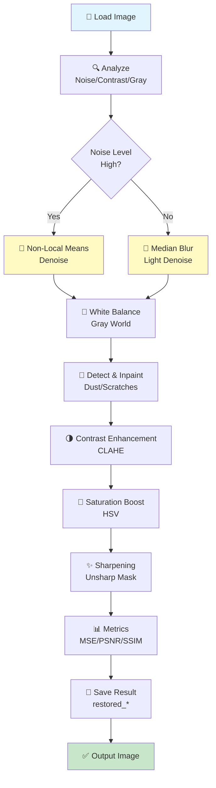

# 🖼️ Color Restoration of Old and Damaged Photographs

Advanced Digital Image Processing (DIP) pipeline to restore faded, noisy, or dust‑spotted historical photographs using OpenCV and NumPy.

---

## 📋 Table of Contents

1. [What This Project Does](#what-this-project-does)
2. [Quick Start](#quick-start)
3. [Project Structure](#project-structure)
4. [Complete Pipeline Flowchart](#complete-pipeline-flowchart)
5. [Algorithms & Methods](#algorithms--methods)
6. [Detailed Algorithm Explanations](#detailed-algorithm-explanations)
7. [Usage Examples](#usage-examples)
8. [Parameter Tuning Guide](#parameter-tuning-guide)
9. [Performance Tips](#performance-tips)
10. [Troubleshooting](#troubleshooting)
11. [Extensions & Improvements](#extensions--improvements)
12. [Release Checklist](#release-checklist)

---

## What This Project Does

🎯 **Input:** Scanned/photographed old images (jpg, png, bmp, tiff)  
📁 **Input Folder:** `dataset/old_images/`  
🎨 **Processing:** Classical DIP pipeline (denoising, white balance, spot removal, contrast, saturation, sharpening)  
💾 **Output Folder:** `results/restored_images/`  
📊 **Metrics:** MSE, PSNR, SSIM quality assessment

**Core Techniques:**
- Non‑Local Means denoising (photographic noise)
- Gray‑World white balance (color cast correction)
- Spot detection + Telea inpainting (dust removal)
- CLAHE (local contrast enhancement)
- Multi‑Scale Retinex (optional, for dramatic lighting)
- Saturation boost (revive faded colors)
- Unsharp masking (detail enhancement)

---

## Quick Start

### Installation

```bash
pip install -r requirements.txt
```

### Run Interactive (displays original vs restored side-by-side)

```powershell
python main.py
```

### Run Headless (recommended for batch processing)

```powershell
python main.py --no-display
```

### Custom Input/Output Folders

```powershell
python main.py --input-dir C:\path\to\images --output-dir C:\path\to\output --no-display
```

---

## Project Structure

```
color_restoration_project/
├── main.py                      # Batch orchestration & CLI
├── restoration.py               # Core algorithms & helpers
├── requirements.txt             # Dependencies
├── README.md                    # This file
├── dataset/
│   └── old_images/             # Place input images here
├── results/
│   └── restored_images/        # Output saved here
└── models/                      # (Reserved for ML models)
```

---

## Complete Pipeline Flowchart

### ASCII Flow Diagram

```
┌─────────────────────────────────────────────────────────────────┐
│                      INPUT: Old Image                           │
└────────────────────────┬────────────────────────────────────────┘
                         │
                         ▼
        ┌────────────────────────────────┐
        │  IMAGE ANALYSIS (Detect Type)  │
        │  • estimate_noise()            │
        │  • is_grayscale()              │
        │  • contrast_score()            │
        └────────┬───────────────────────┘
                 │
        ┌────────▼────────────┐
        │  NOISE LEVEL HIGH?  │
        └────────┬────────────┘
                 │
        ┌────────┴─────────────────────┐
        │                              │
    YES │                              │ NO
        │                              │
        ▼                              ▼
    ┌──────────────────┐         ┌──────────────┐
    │ Non-Local Means  │         │ Median Blur  │
    │ Denoise (NLM)    │         │              │
    └──────┬───────────┘         └────────┬─────┘
        │                              │
        └────────────┬─────────────────┘
                     │
                     ▼
        ┌────────────────────────────┐
        │  WHITE BALANCE             │
        │  (Gray World)              │
        └────────┬───────────────────┘
                 │
                 ▼
        ┌──────────────────────────────┐
        │  SPOT DETECTION + INPAINTING │
        │  (Detect small defects)      │
        │  (Inpaint with Telea)        │
        └────────┬─────────────────────┘
                 │
        ┌────────▼──────────────────┐
        │  CONTRAST ENHANCEMENT      │
        │  (CLAHE on L channel)      │
        └────────┬───────────────────┘
                 │
                 ▼
        ┌──────────────────────────┐
        │  SATURATION BOOST        │
        │  (Scale S in HSV)        │
        └────────┬─────────────────┘
                 │
                 ▼
        ┌──────────────────────────┐
        │  SHARPENING              │
        │  (Unsharp Mask)          │
        └────────┬─────────────────┘
                 │
                 ▼
        ┌──────────────────────────┐
        │  COMPUTE METRICS         │
        │  MSE / PSNR / SSIM       │
        └────────┬─────────────────┘
                 │
                 ▼
        ┌──────────────────────────┐
        │  SAVE + LOG RESULTS      │
        └────────┬─────────────────┘
                 │
                 ▼
┌─────────────────────────────────────────────────────────────────┐
│        OUTPUT: restored_{original_name}                         │
└─────────────────────────────────────────────────────────────────┘
```

### Interactive Mermaid Diagram



---

## Algorithms & Methods

### 1️⃣ Image Analysis (Decision Making)

Determines image condition and processing strategy.

| Algorithm | Function | Input | Output | Purpose |
|-----------|----------|-------|--------|---------|
| **Noise Estimation** | `estimate_noise()` | Grayscale image | Float (stddev) | Decide between NLM vs Median |
| **Grayscale Detection** | `is_grayscale()` | BGR image | Boolean | Detect B/W or faded photos |
| **Contrast Score** | `contrast_score()` | BGR image | Float (stddev) | Assess brightness variation |

---

### 2️⃣ Denoising

Removes photographic or film grain noise while preserving detail.

#### Non-Local Means (NLM)
- **Class:** Patch-based denoising
- **OpenCV:** `fastNlMeansDenoisingColored()`
- **Function:** `nl_means_denoise()`
- **Best for:** Real photographic grain, film noise
- **Key Params:**
  - `h` = filter strength (luminance), 6–25
  - `hColor` = color strength, 6–25
  - Larger `h` = stronger smoothing (risk: plastic look)

#### Median Blur
- **Class:** Morphological filtering
- **OpenCV:** `cv2.medianBlur()`
- **Best for:** Salt-and-pepper noise, light specks
- **Key Params:**
  - `k` = kernel size (odd, 3–9)

#### Bilateral Filter (Optional)
- **Class:** Edge-preserving smoothing
- **Function:** `remove_noise()`
- **Best for:** Moderate noise + edge preservation

**Decision Rule:**
```
if estimate_noise(img) > noise_thresh:
    denoise = nl_means_denoise(img)
else:
    denoise = cv2.medianBlur(img, kernel_size)
```

---

### 3️⃣ Dust & Scratch Removal

Detects and inpaints small defects (dust, scratches, spots).

#### Spot Detection
- **Algorithm:** Residual thresholding + morphological cleanup
- **Function:** `detect_spots_mask()`
- **Method:**
  1. Apply median blur to grayscale
  2. Compute residual = |original – blurred|
  3. Threshold residual (param: `spot_thresh`)
  4. Morphological open (remove noise)
  5. Dilate (expand mask)
- **Output:** Binary mask of defects

#### Inpainting
- **Algorithm:** Telea (fast marching)
- **OpenCV:** `cv2.inpaint(..., cv2.INPAINT_TELEA)`
- **Function:** `inpaint_spots()`
- **Best for:** Small defects (< 1-2% of image)
- **Limitation:** Large tears → use deep inpainting (LaMa)

**Key Params:**
- `spot_thresh` = residual threshold (25–40)
- `spot_blur` = median kernel for detection (7–11)
- `inpaint_radius` = inpaint search radius (2–5)

---

### 4️⃣ Color Correction (White Balance)

Removes global color casts from yellowing, fading, or age.

#### Gray-World Algorithm
- **Assumption:** Average scene color should be neutral gray
- **Function:** `white_balance_grayworld()`
- **Method:**
  1. Compute per-channel means (B, G, R)
  2. Compute overall luminance mean
  3. Scale each channel: `channel *= (luminance_mean / channel_mean)`
- **Pros:** Simple, robust for mild casts
- **Cons:** Fails if scene is naturally colored (e.g., all green outdoor)

#### LAB Space Correction
- **Function:** `white_balance()`
- **Method:**
  1. Convert BGR → LAB
  2. Shift a/b channels so means = 128 (neutral)
  3. Convert back to BGR
- **Pros:** Perceptual color space
- **Cons:** Less aggressive than Gray-World

---

### 5️⃣ Contrast Enhancement

Improves local and/or global contrast for faded images.

#### CLAHE (Contrast Limited Adaptive Histogram Equalization)
- **Applied on:** L channel (LAB)
- **Function:** `enhance_contrast()`
- **Method:**
  1. Convert BGR → LAB, extract L
  2. Apply OpenCV CLAHE with `clipLimit` and `tileGridSize`
  3. Merge modified L back, convert to BGR
- **Pros:** Local detail preservation, no global over-stretch
- **Cons:** Large `clipLimit` amplifies noise
- **Key Params:**
  - `clipLimit` = 1.0–3.0 (higher = more aggressive)
  - `tileGridSize` = (8, 8) default (smaller = more local contrast)

#### Multi-Scale Retinex with Color Restoration (MSRCR)
- **Theory:** Mimics human perception of illumination
- **Functions:**
  - `single_scale_retinex()` = log domain contrast at one scale
  - `multi_scale_retinex()` = combine 3 scales (15, 80, 250 pixels)
  - `msrcr()` = full pipeline with color restoration factor
- **Best for:** Severe fading, strong lighting gradients
- **Pros:** Global + local contrast, color restoration
- **Cons:** Requires tuning; can produce halos
- **Usage:** Via `restore_image_msr_wrapper(..., msr=True)`

---

### 6️⃣ Color Enhancement

Revives faded chroma (saturation).

#### Saturation Boost
- **Space:** HSV (Hue, Saturation, Value)
- **Function:** `increase_saturation()`
- **Method:**
  1. Convert BGR → HSV
  2. Multiply S channel by `scale` (1.05–1.30)
  3. Convert back to BGR
- **Caution:** Avoid `scale > 1.5` → over-saturation, posterization
- **Typical:** 1.10–1.25

---

### 7️⃣ Sharpening

Enhances edge definition and detail.

#### Unsharp Masking
- **Method:** `blur_img = GaussianBlur(img); sharp = img + amount * (img – blur_img)`
- **OpenCV:** `cv2.addWeighted()`
- **Function:** Used in `restore_image()`
- **Param:** `unsharp_amount` = 0.2–0.5
- **Caution:** High amounts → halos/ringing

#### Kernel Sharpening
- **Function:** `sharpen_image()`
- **Kernel:**
  ```
  [  0  -1   0 ]
  [ -1   5  -1 ]
  [  0  -1   0 ]
  ```

---

### 8️⃣ Quality Metrics

Evaluate restoration quality (used in logs).

| Metric | Function | Range | Interpretation |
|--------|----------|-------|-----------------|
| **MSE** | `mse()` | 0–∞ | Lower = better (0 = identical) |
| **PSNR** | `psnr()` | 0–∞ dB | Higher = better (>20 dB acceptable) |
| **SSIM** | `ssim()` | -1 to 1 | Higher = better (>0.8 good) |

---

## Detailed Algorithm Explanations

### Non-Local Means Denoising Deep Dive

**Intuition:** Instead of smoothing locally (like Gaussian), find similar patches across the entire image and average them.

**Algorithm:**
1. For each pixel `p`:
   - Extract a template patch around `p` (e.g., 7×7)
   - Search for similar patches in a large window (e.g., 21×21)
   - Compute Euclidean distances to all patches
   - Weight patches inversely by distance: `w = exp(-dist² / h²)`
   - Denoise `p` = weighted average of all similar patches
2. `h` controls the decay of weights (filter strength)

**Tuning Guide:**
- Small images or light noise: `h` = 6–8
- Medium images, moderate noise: `h` = 10–15
- Heavy grain/old film: `h` = 20–25

---

### CLAHE Deep Dive

**Intuition:** Apply histogram equalization locally (each 8×8 tile) to boost contrast without over-stretching globally.

**Algorithm:**
1. Divide image into grid (e.g., 8×8 tiles)
2. For each tile, compute histogram & cumulative distribution
3. **Limit clipping:** If histogram bins exceed threshold (`clipLimit`), redistribute excess
4. Apply cumulative distribution to pixels (equalization)
5. Interpolate across tile boundaries (smooth transitions)

**Effect:**
- Small `clipLimit` (1.0–1.5): Natural, subtle contrast
- Large `clipLimit` (2.5–3.0): Heavy local detail, risk amplifying noise
- Larger tiles (16×16): Smoother but less local; smaller (4×4): More detail but potential artifacts

---

### Telea Inpainting Deep Dive

**Intuition:** Use fast marching algorithm to propagate texture/color from boundaries into holes.

**Algorithm:**
1. Identify mask boundary (hole edges)
2. Iteratively expand inpainting from boundary inward
3. For each pixel to inpaint, estimate value from nearby frontier pixels
4. Use edge-preserving interpolation (prefers aligned gradients)

**Best for:** Small holes, smooth regions  
**Poor for:** Large complex structures, fine textures

---

## Usage Examples

### Example 1: Process Batch Headless

```powershell
python main.py --no-display
```

**Output:**
```
[INFO] Input folder: ...dataset\old_images
[INFO] Output folder: ...results\restored_images
[INFO] Processing: ...dataset\old_images\photo1.jpg
[INFO] Detected condition: Noisy + Low-Contrast
[INFO] Noise level: 15.32, Contrast score: 28.50
[INFO] MSE: 456.78, PSNR: 21.53, SSIM: 0.8756
[INFO] Saved restored image (mild) to: ...results\restored_images\restored_photo1.jpg
```

### Example 2: Process Custom Folder

```powershell
python main.py --input-dir "D:\old_photos" --output-dir "D:\restored" --no-display
```

### Example 3: Interactive Display

```powershell
python main.py
```

Shows side-by-side comparison plots for each image (blocks until closed).

---

## Parameter Tuning Guide

### Quick Reference Table

| Parameter | Range | Default (Mild) | Effect |
|-----------|-------|-----------------|--------|
| `nlm_h` | 6–25 | 6 | Denoising strength (↑ = stronger) |
| `median_k` | 3–9 | 3 | Median kernel (↑ = more aggressive) |
| `clahe_clip` | 1.0–3.0 | 1.2 | Local contrast (↑ = stronger) |
| `sat_scale` | 1.0–1.5 | 1.05 | Saturation (↑ = more vivid) |
| `unsharp_amount` | 0.1–0.7 | 0.2 | Sharpening (↑ = more detail) |
| `spot_thresh` | 20–50 | 50 | Spot sensitivity (↓ = detect more) |

### Tuning Workflow

1. **Analyze image:** Run `analyze_and_restore()` to check noise/contrast levels
2. **Small batch downscale:** Process at 50% resolution for quick feedback
3. **Adjust one param at a time:** Change `nlm_h`, then `clahe_clip`, etc.
4. **Visual inspection:** Check side-by-side comparison
5. **Metrics check:** Compare MSE/PSNR/SSIM (relative, not absolute)
6. **Full resolution:** Reprocess at original size with best params

### Common Scenarios

#### Scenario: Very Noisy Old Photo
```python
restore_image(img, nlm_h=20, clahe_clip=1.5, unsharp_amount=0.3)
```
- High NLM for strong grain removal
- Modest CLAHE to avoid amplifying residual noise

#### Scenario: Extremely Faded Photo
```python
restore_image(img, nlm_h=10, clahe_clip=2.5, sat_scale=1.25, unsharp_amount=0.4)
```
- Moderate NLM
- Aggressive CLAHE + saturation
- Stronger sharpening for detail recovery

#### Scenario: Slightly Yellowed Photo
```python
white_balance_grayworld(img)  # or white_balance()
restore_image(img, nlm_h=6, clahe_clip=1.5, sat_scale=1.10)
```
- Focus on white balance first
- Light denoising + moderate contrast
- Mild saturation boost

---

## Performance Tips

### Speed Optimizations

1. **Downscale & Parameter Search**
   ```python
   small = cv2.resize(img, (img.shape[1]//2, img.shape[0]//2))
   restored_small = restore_image(small, nlm_h=10, clahe_clip=2.0)
   # Inspect, then run full resolution
   ```

2. **Batch Processing (Parallel)**
   ```python
   from multiprocessing import Pool
   with Pool(4) as p:
       p.map(process_single_image, image_list)
   ```

3. **NLM Performance**
   - NLM is the slowest step (~80% of runtime)
   - Use smaller `templateWindowSize` (5 instead of 7) for speed
   - Consider lightweight GPU denoisers (FFDNet, DnCNN) for large batches

### Memory Efficiency

- Large images (4K+): Process in blocks or downscale
- Use `uint8` (not float32) for storage to save 4× memory

---

## Troubleshooting

### Issue: Output looks over-smoothed/plastic

**Cause:** NLM `h` too high or CLAHE `clipLimit` too aggressive  
**Fix:**
```python
restore_image(img, nlm_h=8, clahe_clip=1.2, unsharp_amount=0.3)
```

### Issue: Noise is amplified after CLAHE

**Cause:** Heavy local contrast amplifies residual noise  
**Fix:** Increase denoising before CLAHE
```python
restore_image(img, nlm_h=15, clahe_clip=1.5)
```

### Issue: Color shift or oversaturation

**Cause:** White balance overshoots or `sat_scale` too high  
**Fix:**
```python
sat_scale=1.10  # Reduce from 1.25
# Or use LAB white balance instead of Gray-World
```

### Issue: Inpainting leaves artifacts

**Cause:** Defect mask too large or Telea limitation  
**Fix:** Reduce `spot_thresh` (detect more conservatively) or use deep inpainting (LaMa)

### Issue: Script crashes on corrupted image

**Fix:** Already handled with per-image try/except. Check logs for which file failed.

---

## Extensions & Improvements

### 1. Replace NLM with Learned Denoiser

**Options:**
- FFDNet (fast, GPU support)
- DnCNN (mid-speed, good quality)
- Real-ESRGAN (combines denoising + super-resolution)

**Integration:**
```python
# In restore_image():
if use_learned_denoiser:
    denoise = ffdnet_denoise(img, noise_sigma)
else:
    denoise = nl_means_denoise(img, h=nlm_h)
```

### 2. Colorization for B&W Photos

**Options:**
- DeOldify (model-based, realistic)
- User-guided colorization

**Integration:**
```python
if is_grayscale(img) and colorize_enabled:
    img = colorize_image(img)  # Before main pipeline
```

### 3. Super-Resolution (Optional Final Step)

**Options:**
- Real-ESRGAN (2–4× upscale)
- BSRGAN

**Integration:**
```python
# After all restoration:
if enable_sr:
    restored = super_resolve(restored, scale=2)
```

### 4. Deep Inpainting (Large Defects)

**Options:**
- LaMa (Large Mask Inpainting, SOTA)
- Partial Convolution

**Integration:**
```python
if defect_size > threshold:
    restored = lama_inpaint(restored, large_mask)
else:
    restored = cv2.inpaint(restored, small_mask, INPAINT_TELEA)
```

---

## Release Checklist

- [x] Core pipeline (denoising, white balance, CLAHE, saturation, sharpening)
- [x] Per-image error handling & logging
- [x] CLI flags (`--no-display`, `--input-dir`, `--output-dir`)
- [x] Single canonical output per image (`restored_{name}`)
- [x] Quality metrics (MSE/PSNR/SSIM)
- [x] Enhanced README with flowcharts & detailed explanations
- [ ] Add `--preset` flag to choose alt. presets (balanced/aggressive/msr)
- [ ] Add `--verbose` logging level
- [ ] Add unit tests for helpers
- [ ] Add sample images to `dataset/example/`
- [ ] Add GPU support (optional, for CUDA)
- [ ] Parallelize batch processing (`--jobs` flag)

---

## Contact & Credits

**Dependencies:**
- OpenCV (`opencv-python`)
- NumPy (`numpy`)
- Matplotlib (`matplotlib`)

**References:**
- Non-Local Means: Buades et al., 2005
- CLAHE: Zuiderveld, 1994
- Retinex: Land & McCann, 1971
- Telea Inpainting: Telea, 2004

---

**Last Updated:** March 17, 2026

For questions or improvements, refer to the [usage examples](#usage-examples) or [parameter tuning guide](#parameter-tuning-guide).
